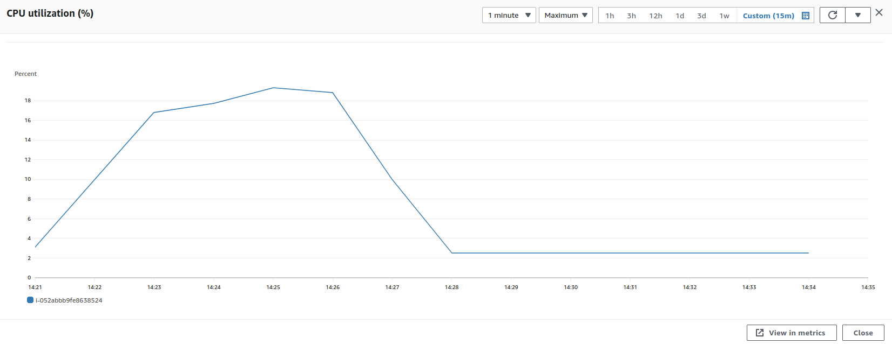
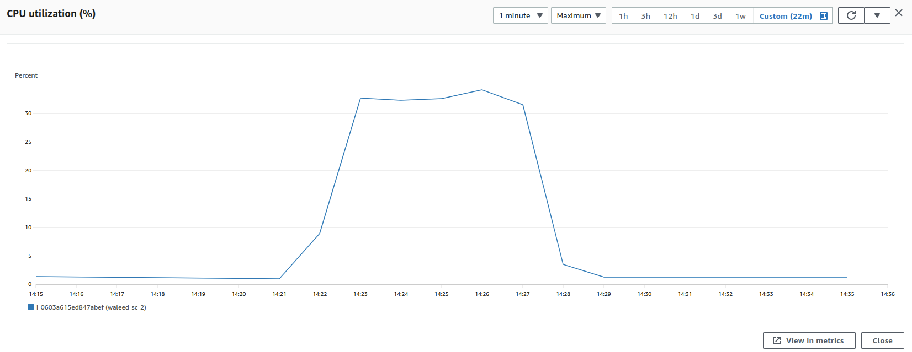
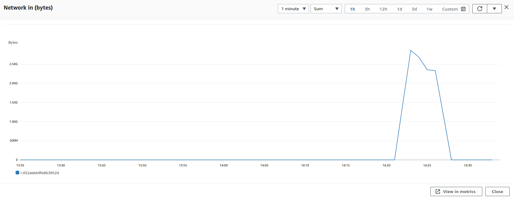
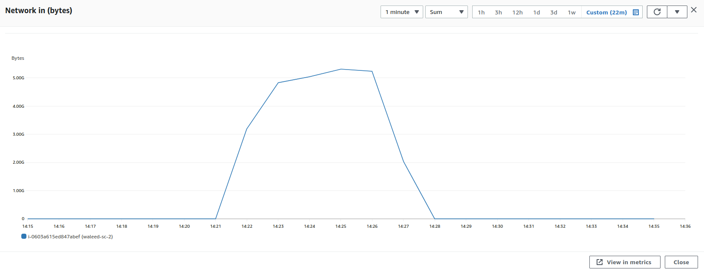
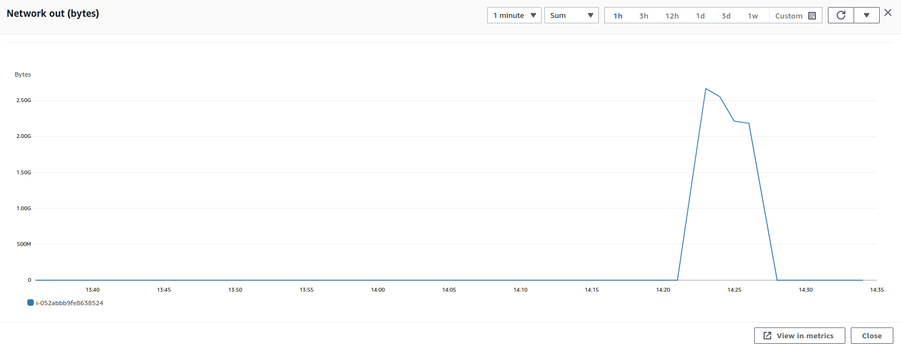
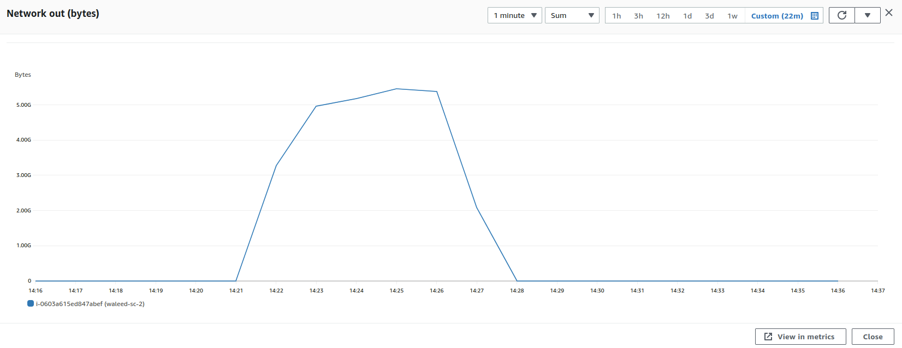

### Parameters

| Parameter | Value                |
| :-------- |:------------------------- |
| `Agentless Users` | 200 |
| `Agentbased Users` | 200 |
| `Concurrency` | 100% |
| `Limit` | 188 KB |
| `File Size` | 5.1 mb |

## Results

|  Item | Relay            | Connector |
| :------------------------- |:------------------------- |:------------------------- |
| `Throughput` | 378.6 Mbps | 706.6 Mbps |
| `CPU Usage` | 19.2% | 34.2% |
| CPU |  |   |
| Network In |  |   |
| Network Out |  |   |