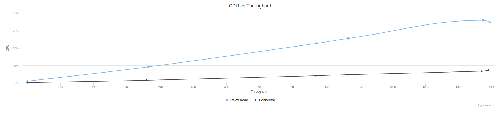

### Specs / Results
<table>
   <th>  No. </th><th> Relay CPU </th><th> Connector CPU </th><th> Summary </th>
   <tbody>
      <tr>
       <tr><td>1. </td><td> 2 </td><td> 4 </td>
        <td> 
            <table>
                 <tr><th> Relay </th><th> Connector </th><th> User/threads </th><th> File Size </th><th> PPS </th><th> Results</th></tr>
                <tbody>
                    <tr><td> Throughput: 364.8 Mbps   CPU: 23% </td><td> Throughput: 359 Mbps   CPU: 3.8% </td><td> 1000 </td><td> 5.4 MBs  </td><td> 67000 </td>
                    <td> <a href="u-1000-f-5.4/README.md"> View Results </td></tr>
                    <tr><td> Throughput: 871.8 Mbps   CPU: 56.6% </td><td> Throughput: 869 Mbps   CPU: 10.3% </td><td> 700 (rate-limit: 1mbps) </td><td> 30.8 MBs  </td><td> 75036 </td>
                    <td> <a href="u-700-f-30.8-limit-1mbps/README.md"> View Results </td></tr>
                    <tr><td> Throughput: 966.1 Mbps   CPU: 63.6% </td><td> Throughput: 963.4 Mbps   CPU: 11.8% </td><td> 900 (rate-limit: 1mbps) </td><td> 30.8 MBs  </td><td> 82346 </td>
                    <td> <a href="u-900-f-30.8-limit-1mbps/README.md"> View Results </td></tr>
                    <tr><td> Throughput: 1372.8 Mbps   CPU: 89.6% </td><td> Throughput: 1369.5 Mbps   CPU: 16.8% </td><td> 1000 </td><td> 30.8 MBs  </td><td> 191666 </td>
                    <td> <a href="u-1000-f-30.8/README.md"> View Results </td></tr>
                    <tr><td> Throughput: 1384.8 Mbps   CPU: 86% </td><td> Throughput: 1381 Mbps   CPU: 18.1% </td><td> 900 </td><td> 30.8 MBs  </td><td> 135661 </td>
                    <td> <a href="u-900-f-30.8/README.md"> View Results </td></tr>
                    <tr><td> Throughput: 1394.8 Mbps   CPU: 86.6% </td><td> Throughput: 1388.7 Mbps   CPU: 18.8% </td><td> 700 </td><td> 30.8 MBs  </td><td> 111356 </td>
                    <td> <a href="u-700-f-30.8/README.md"> View Results </td></tr>
                </tbody>
            </table>
         </td></tr>
      </tr>
      
   </tbody>
</table>

## CPU vs Throughput

