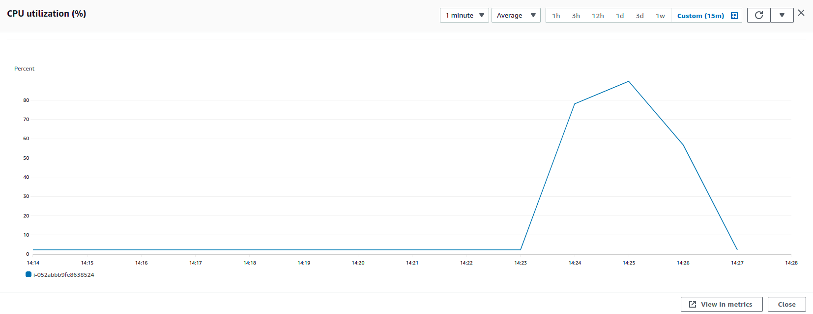

### Parameters

| Parameter | Value                |
| :-------- |:------------------------- |
| `Users` | 1000 |
| `Concurrency` | 100% |
| `PPS` | 191666 |
| `Data Transfer` | 31.88 Gb |
| `File Size` | 30.8 mb |

## Results

|  Item | Relay            | Connector |
| :------------------------- |:------------------------- |:------------------------- |
| `Throughput` | 1372.8 Mbps | 1369.5 Mbps |
| `CPU Usage` | 89% | 16.81% |
| `Memory Usage` | 16.9% | 2.9% |
| CPU |  |   |
| Network In |  |   |
| Network Out |  |   |