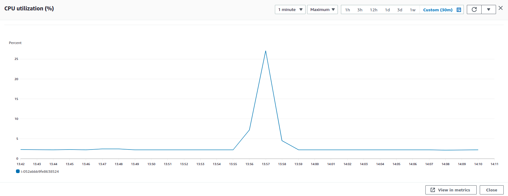
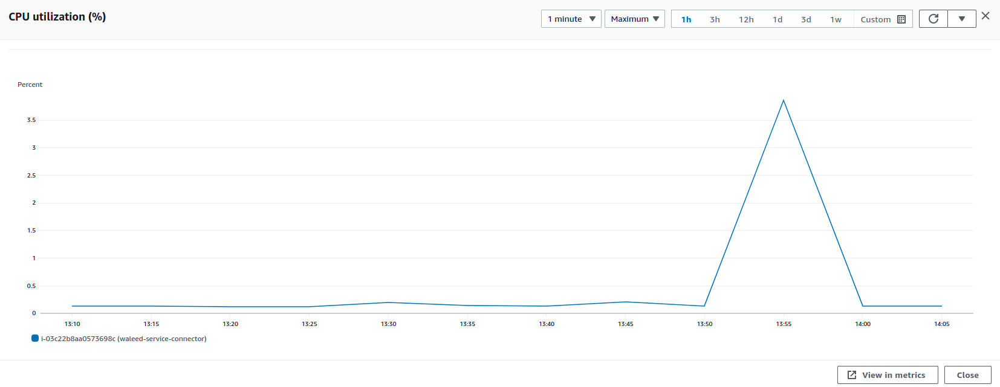
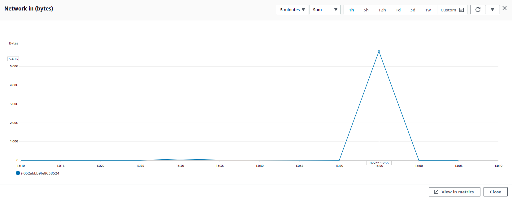
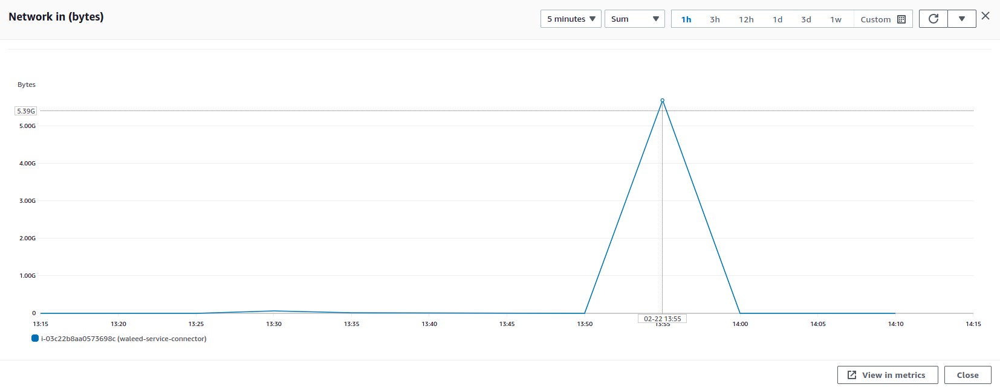
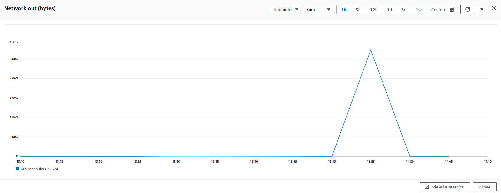
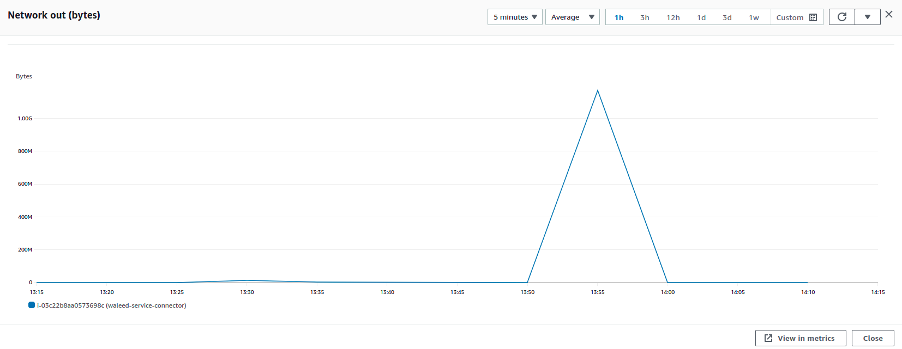

### Parameters

| Parameter | Value                |
| :-------- |:------------------------- |
| `Users` | 1000 |
| `Concurrency` | 100% |
| `PPS` | 67000 |
| `File Size` | 5.4 mb |

## Results

|  Item | Relay            | Connector |
| :------------------------- |:------------------------- |:------------------------- |
| `Throughput` | 364.8 Mbps | 359.3 Mbps |
| `CPU Usage` | 23% | 3.81% |
| `Memory Usage` | 15.6% | 2.9% |
| CPU |  |   |
| Network In |  |   |
| Network Out |  |   |