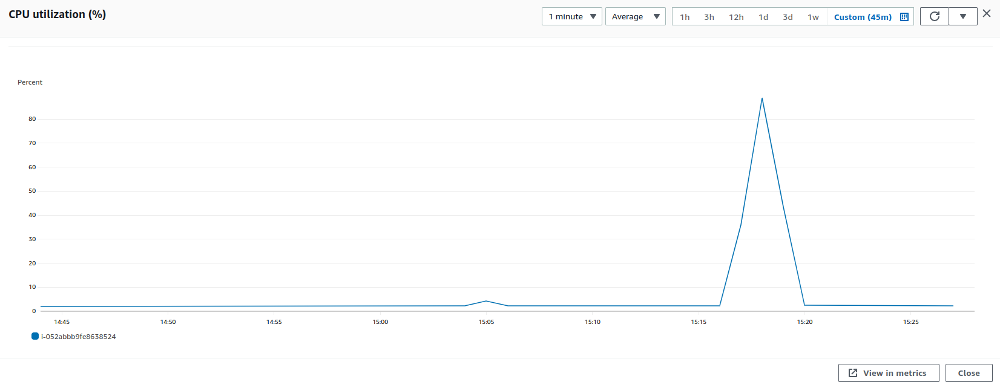
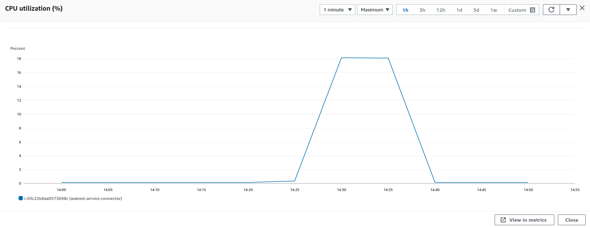
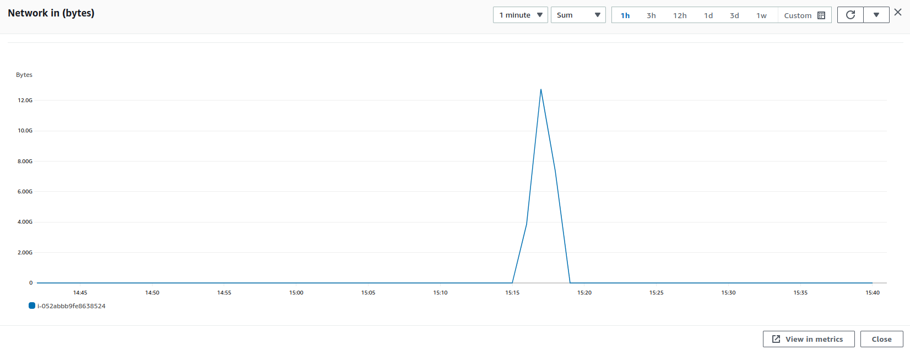
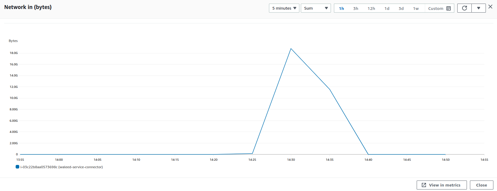
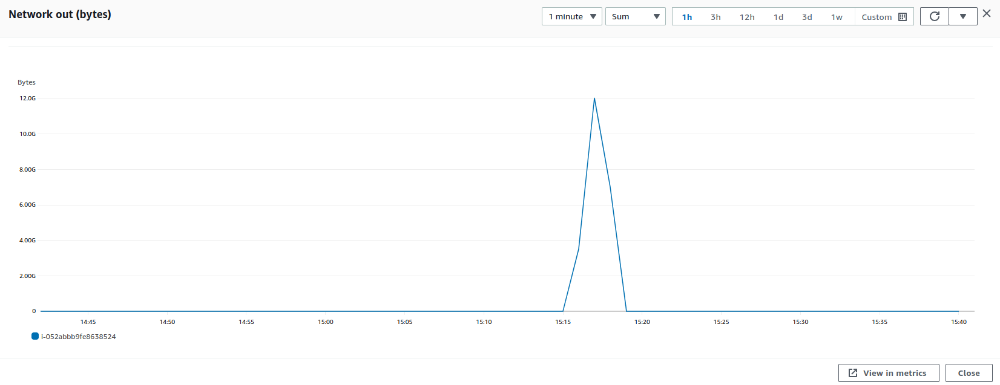
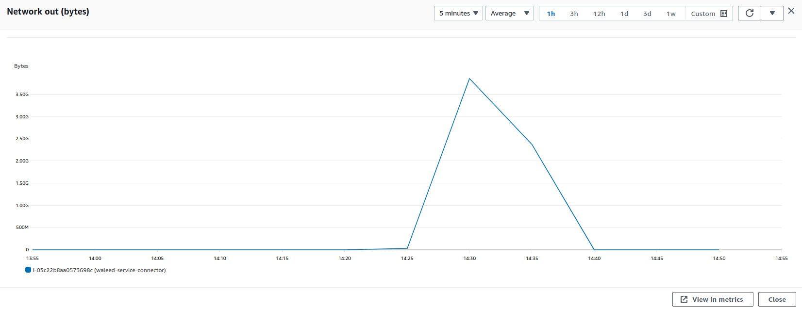

### Parameters

| Parameter | Value                |
| :-------- |:------------------------- |
| `Users` | 700 |
| `Concurrency` | 100% |
| `PPS` | 191666 |
| `Data Transfer` | 22.6 Gb |
| `File Size` | 30.8 mb |

## Results

|  Item | Relay            | Connector |
| :------------------------- |:------------------------- |:------------------------- |
| `Throughput` | 1394.8 Mbps | 1388.1 Mbps |
| `CPU Usage` | 86.6% | 18.1% |
| `Memory Usage` | 15.7% | 3.7% |
| CPU |  |   |
| Network In |  |   |
| Network Out |  |   |