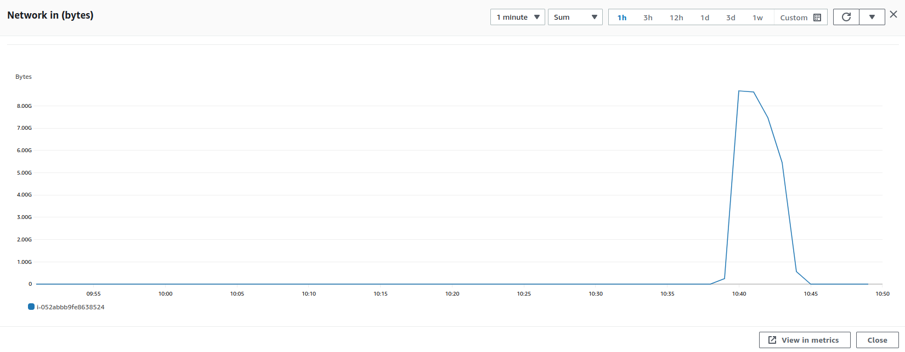

### Parameters

| Parameter | Value                |
| :-------- |:------------------------- |
| `Users` | 900 |
| `Concurrency` | 100% |
| `PPS` | 82346 |
| `Data Transfer` | 29.6 Gb |
| `File Size` | 30.8 mb |
| `Limit Rate` | 1 mbps |

## Results

|  Item | Relay            | Connector |
| :------------------------- |:------------------------- |:------------------------- |
| `Throughput` | 966.1 Mbps | 963.4 Mbps |
| `CPU Usage` | 63.6% | 11.8% |
| `Memory Usage` | 16.6% | 3.5% |
| CPU |  |   |
| Network In |  |   |
| Network Out |  |   |