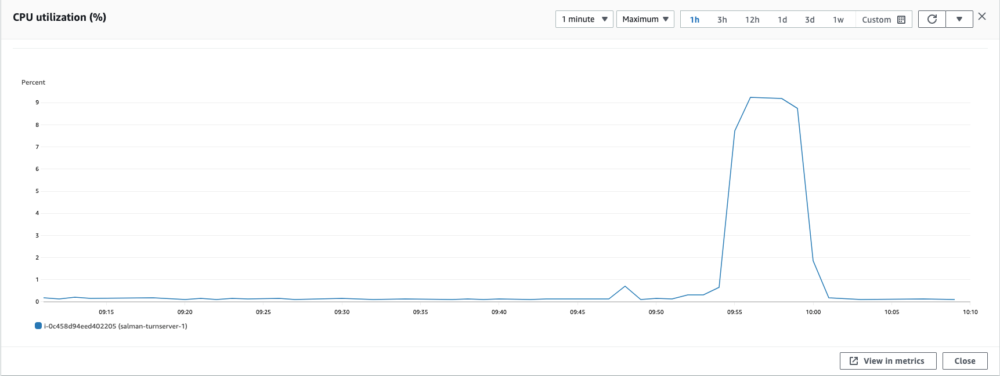
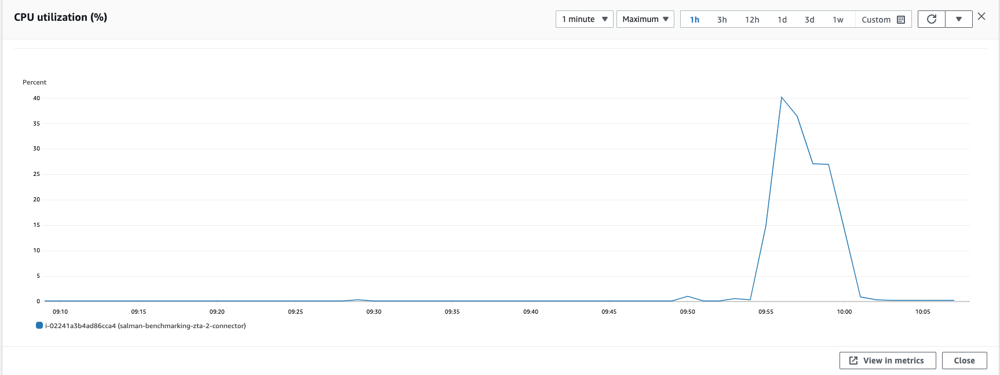
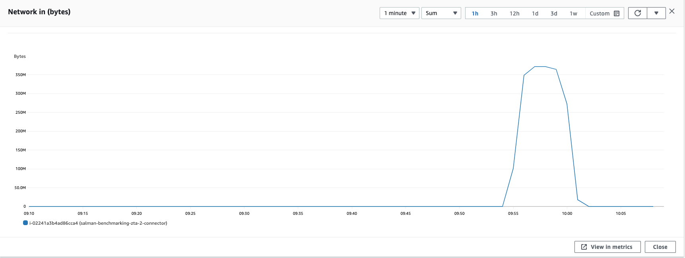
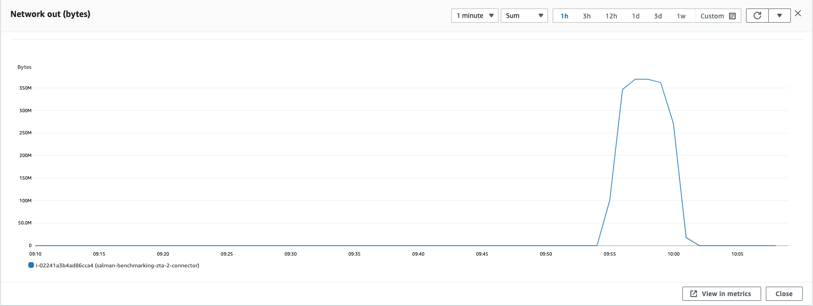

### Parameters

| Parameter | Value                |
| :-------- |:------------------------- |
| `Users` | 800 |
| `Throughput per user` | 800 Mbps |

## Results

|  Item | Value            |
| :------------------------- |:------------------------- |
| `Response Time < 400ms` | 51.1744% |
| `400 ms > Response Time < 1s` | 48.64% | 
| `Packet Loss` | 0.181% |
| `Bad Packet Loss` | 0% |
| `Score` | 9.0775 |

|  Item | Relay            | Connector |
| :------------------------- |:------------------------- |:------------------------- |
| `Throughput` | 709.97 Mbps | 712.704 Mbps |
| `CPU Usage` | 94.2% | 98.1% |
| CPU |  |   |
| Network In |  |   |
| Network Out |  |   |