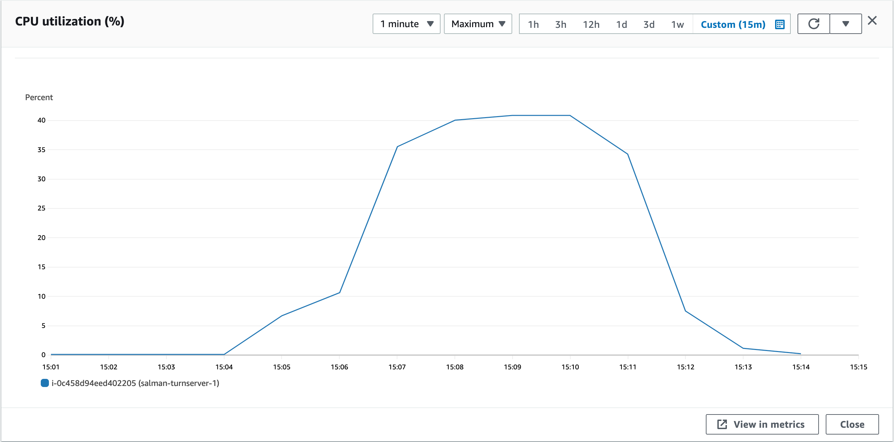
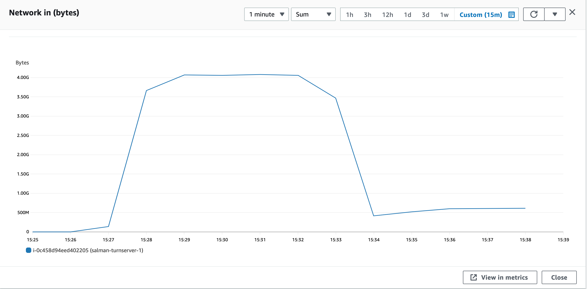
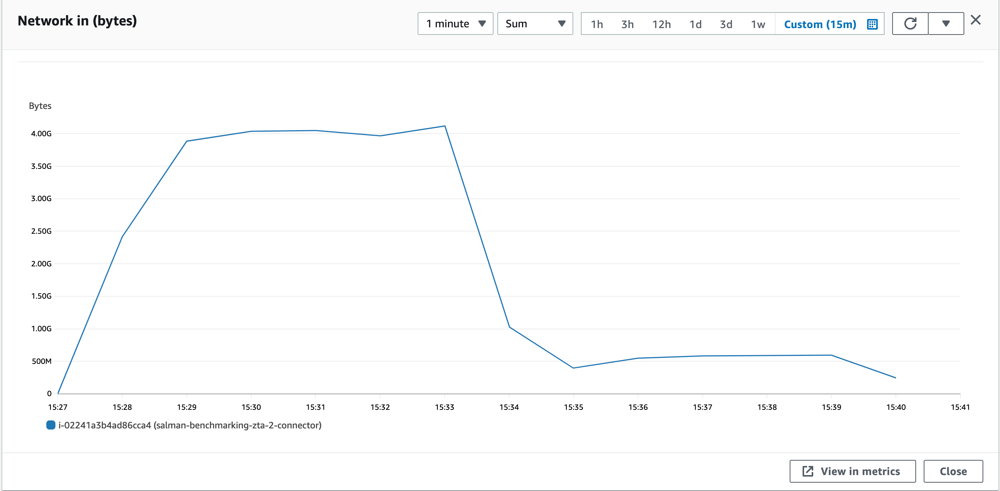
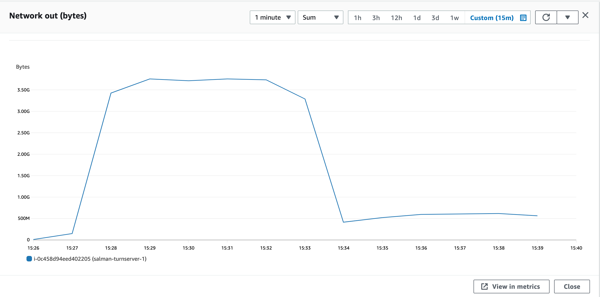
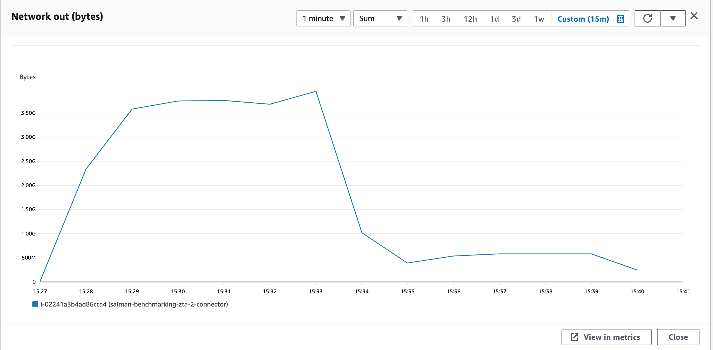

### Parameters

| Parameter | Value                |
| :-------- |:------------------------- |
| `Users` | 500 |
| `Per user threads` | 10 |
| `PPS` | 16 |
| `Packet Size` | 192 |

## Results

|  Item | Value            |
| :------------------------- |:------------------------- |
| `Response Time < 400ms` | 0.005% |
| `400 ms > Response Time < 1s` | 0.002% | 
| `Packet Loss` | 99.99% |
| `Bad Packet Loss` | 0% |
| `Score` | -- |

|  Item | Relay            | Connector |
| :------------------------- |:------------------------- |:------------------------- |
| `Throughput` | 613 Mbps | 549.33 Mbps |
| `CPU Usage` | 84% | 98% |
| CPU |  |   |
| Network In |  |   |
| Network Out |  |   |