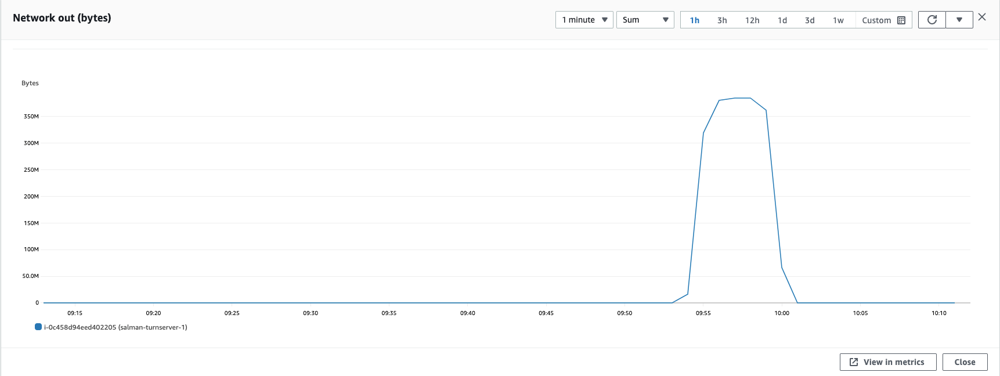
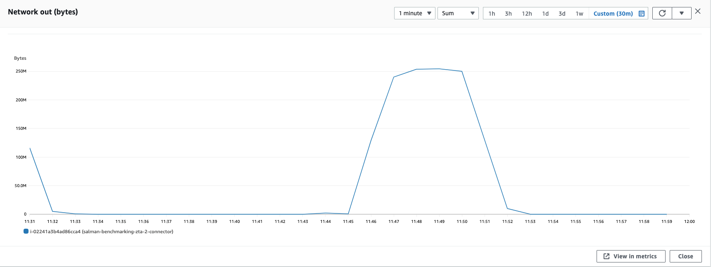

### Parameters

| Parameter | Value                |
| :-------- |:------------------------- |
| `Users` | 100 |
| `Per user threads` | 1 |
| `PPS` | 16 |
| `Packet Size` | 192 bytes |

## Results

|  Item | Value            |
| :------------------------- |:------------------------- |
| `Response Time < 400ms` | 100% |
| `400 ms > Response Time < 1s` | 0% | 
| `Packet Loss` | 0% |
| `Bad Packet Loss` | 0% |
| `Score` | 9.49s |

|  Item | Relay            | Connector |
| :------------------------- |:------------------------- |:------------------------- |
| `Throughput` | 35.73 Mbps | 33.73 Mbps |
| `CPU Usage` | 8.48% | 26.5% |
| CPU |  |   |
| Network In |  |   |
| Network Out |  |   |