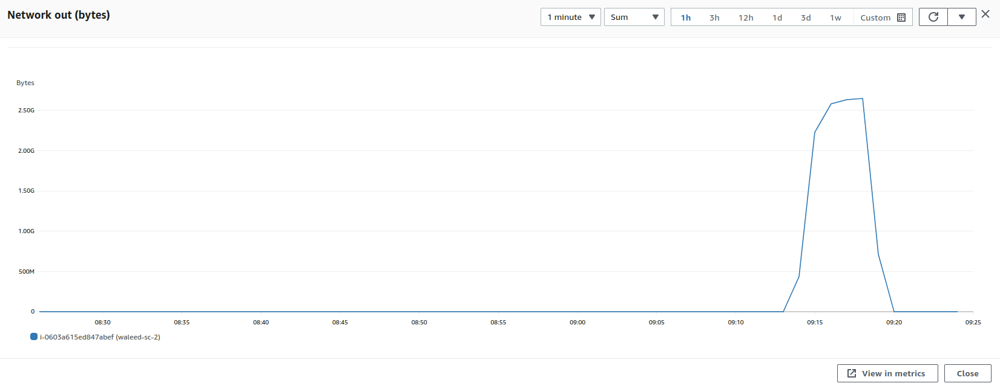

### Parameters

| Parameter | Value                |
| :-------- |:------------------------- |
| `Users` | 200 |
| `Concurrency` | 100% |
| `Limit` | 188 KB |
| `File Size` | 5.1 mb |

## Results

|  Item | Relay            | Connector |
| :------------------------- |:------------------------- |:------------------------- |
| `Throughput` | - | 346 Mbps |
| `CPU Usage` | - | 30.1% |
| `Memory Usage` | - | 15.4 |
| CPU | - |   |
| Network In | - |   |
| Network Out | - |   |