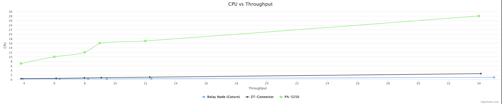

## CPU vs Throughput
|  Throughput (Mbps) | PA-5250 | Relay (Coturn) | Connector |
| :------------------------- |:------------------------- | :------------------------- |:------------------------- |
| 3.8 Mbps | 7% | 0.18% |  0.4% |
| 6 Mbps | 10% | 0.2% |  0.5% |
| 8 Mbps | 12% | 0.25% |  0.66% |
| 9 Mbps | 16% | 0.28% |  0.78% |
| 12 Mbps | 17% | 0.37% |  1% |
| 34 Mbps | 28% | 0.94% |  2.57% |

