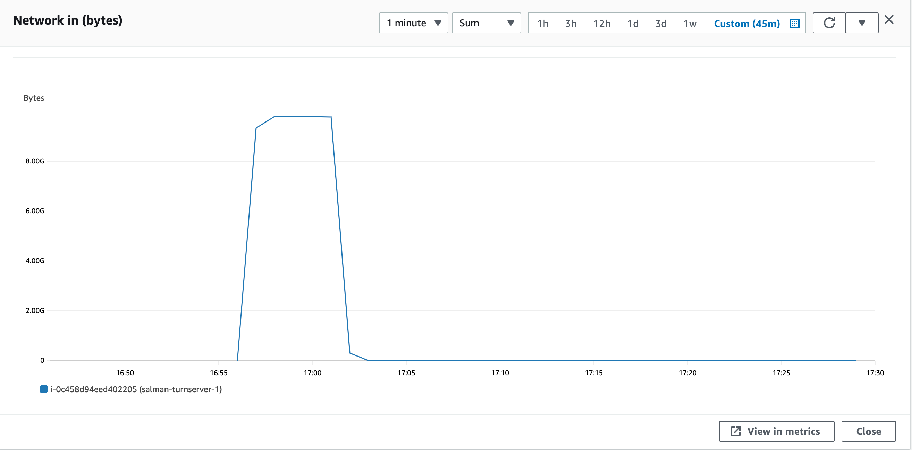
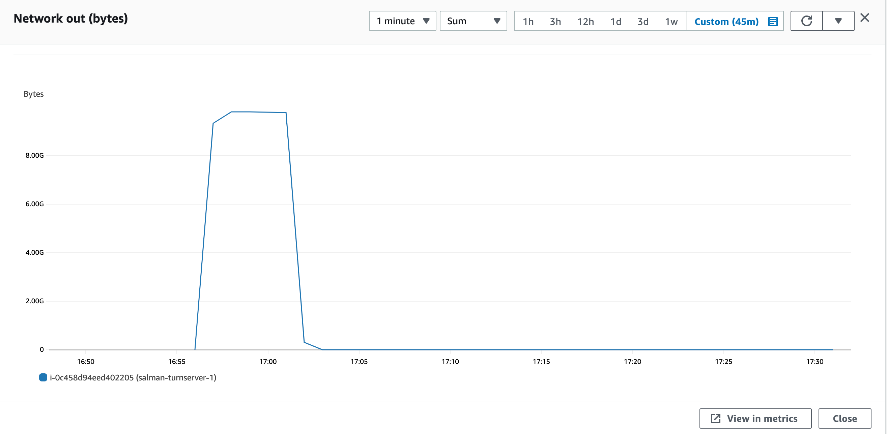
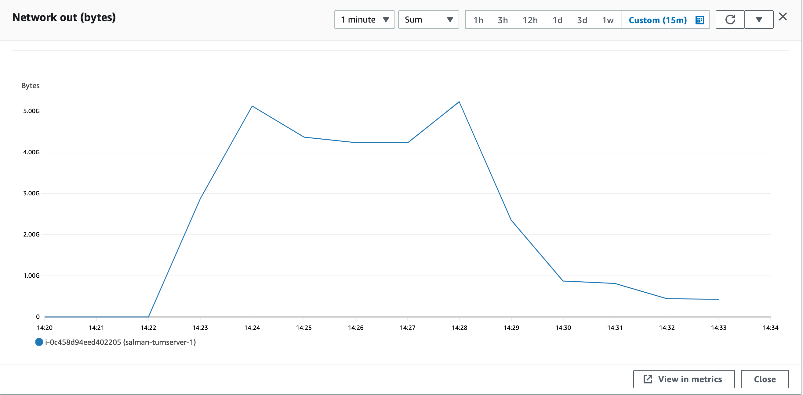

### Parameters

| Parameter | Value                |
| :-------- |:------------------------- |
| `concurent connections` | 1500 |
| `duration` | 300s |
| `packets per second` | 54 |
| `packet size` | 960 bytes |

## Results

|  Item | Coturn            |  Pion/Turn |
| :------------------------- |:------------------------- |:------------------------- |
| `Throughput` | 1335.296 Mbps | 1342.12 Mbps |
| `CPU Usage` | 57.1% | 67.1% |
| `Response Time < 400ms` | 71.72% | 53.60% |
| `400 ms > Response Time < 1s` | 28.27% | 28.53% |
| `Packet Loss` | 0.0005% | 17.865% |
| `Bad Packet Loss` | 0% | 0.0002% |
| `Score` | 9.29 | 3.424 |
| CPU |  |   |
| Network In |  |   |
| Network Out |  |   |