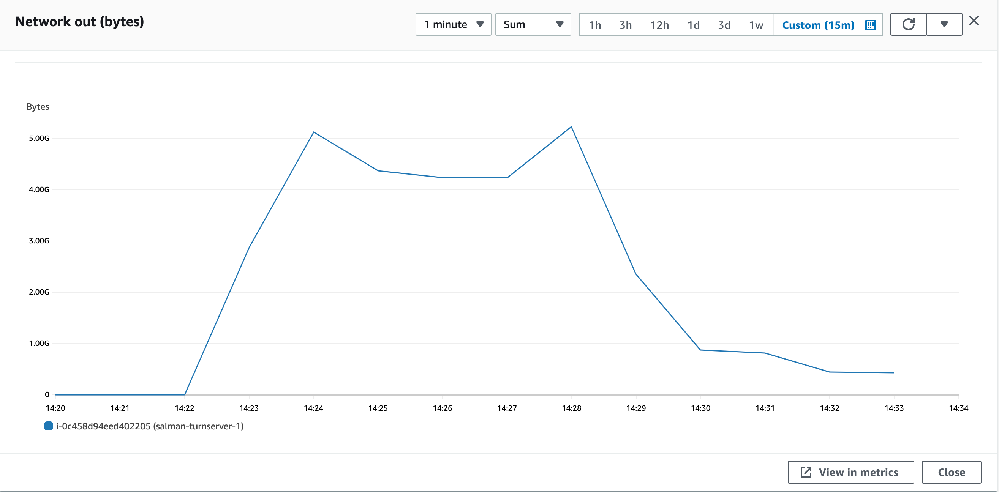

### Parameters

| Parameter | Value                |
| :-------- |:------------------------- |
| `concurent connections` | 1500 |
| `duration` | 300s |
| `packets per second` | 90 |
| `packet size` | 960 bytes |

## Results

### Pion/Turn
| Parameter | Value                |
| :-------- |:------------------------- |
| `Throughput` | 1870.5 Mbps |
| `CPU Usage` | 53.1%% |
| `Response Time < 400ms` | 5.721% |
| `400 ms > Response Time < 1s` | 6.99% |
| `Packet Loss` | 83.78%% |
| `Bad Packet Loss` | 36.42% |
| `Score` | -54.54 |

