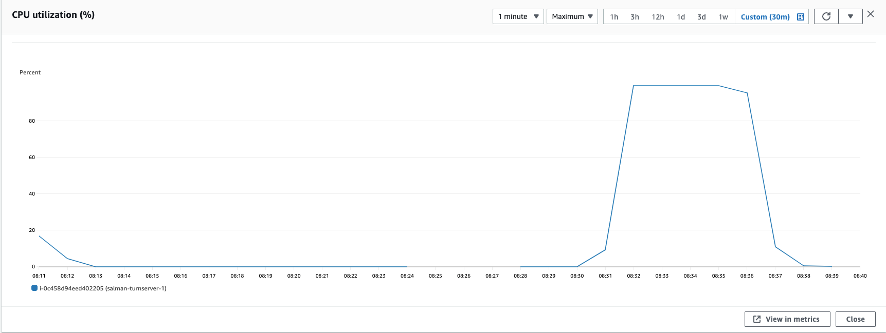
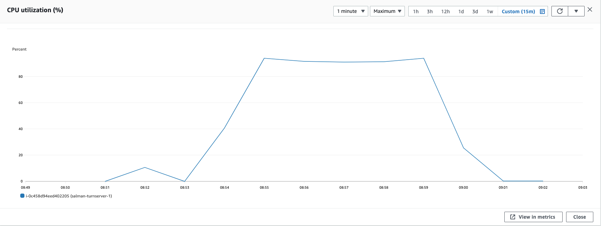

### Parameters

| Parameter | Value                |
| :-------- |:------------------------- |
| `concurent connections` | 1500 |
| `duration` | 300s |
| `packets per second` | 54 |
| `packet size` | 960 bytes |

## Results

|  Item | Coturn            |  Pion/Turn |
| :------------------------- |:------------------------- |:------------------------- |
| `Throughput` | 1325.73 Mbps |  1115.47 Mbps|
| `CPU Usage` | 99.2% |  93% |
| `Response Time < 400ms` | 1.835% |  2.107% |
| `400 ms > Response Time < 1s` | 22.334% |  6.405% |
| `Packet Loss` | 75.829% |  90.195% |
| `Bad Packet Loss` | 2.377% |  64.245% |
| `Score` | -17.95 |  -84.446 |
| CPU |  |   |
| Network In |  |   |
| Network Out |  |   |