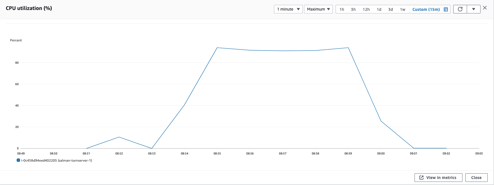
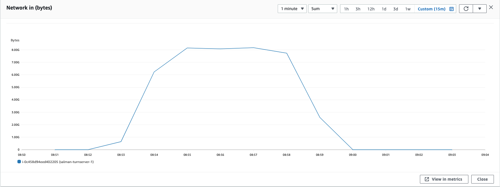
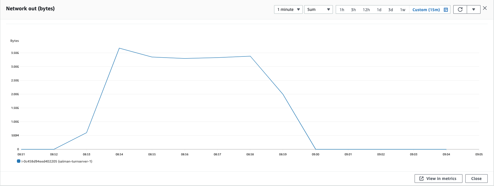

### Parameters

| Parameter | Value                |
| :-------- |:------------------------- |
| `concurent connections` | 2000 |
| `duration` | 300s |
| `packets per second` | 90 |
| `packet size` | 580 bytes |

## Results

### Pion/Turn
| Parameter | Value                |
| :-------- |:------------------------- |
| `Throughput` | 1115.47 Mbps |
| `CPU Usage` | 93% |
| `Response Time < 400ms` | 2.107% |
| `400 ms > Response Time < 1s` | 6.405% |
| `Packet Loss` | 90.195% |
| `Bad Packet Loss` | 64.245% |
| `Score` | -84.446 |

