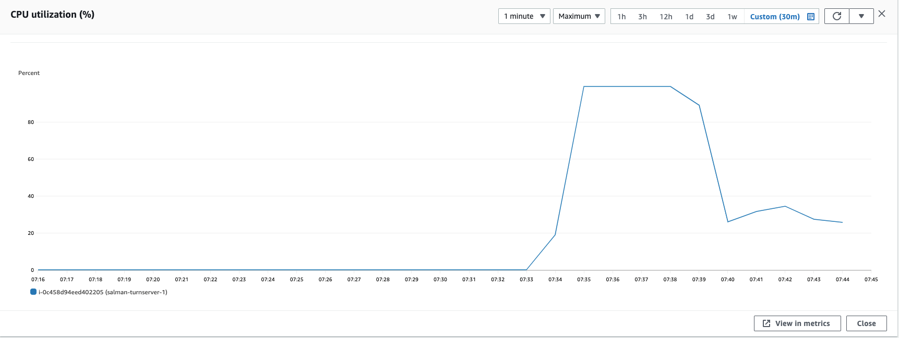
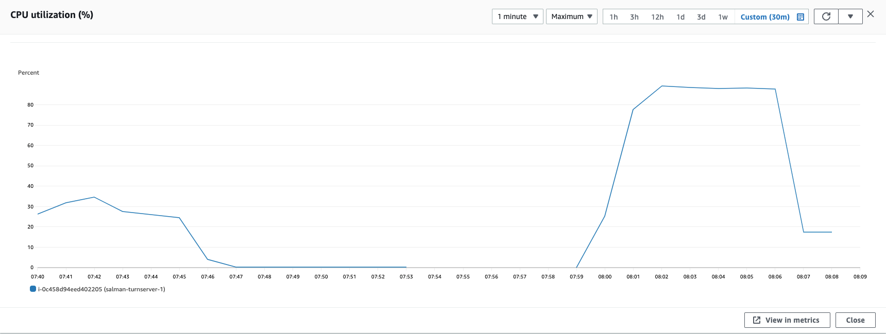
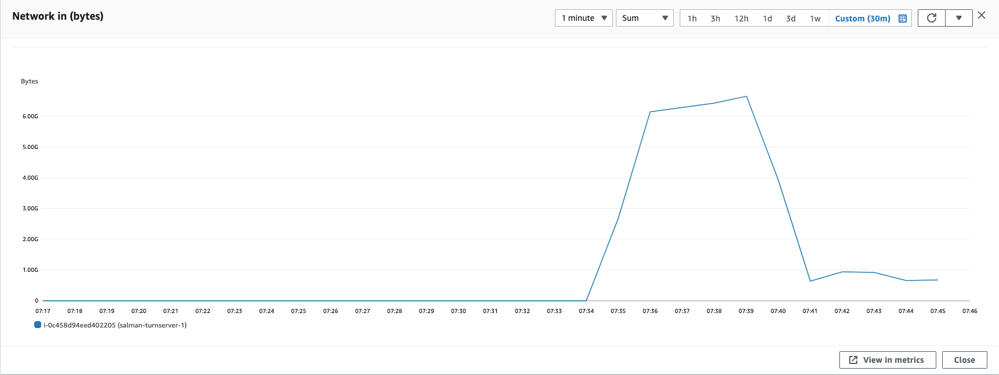
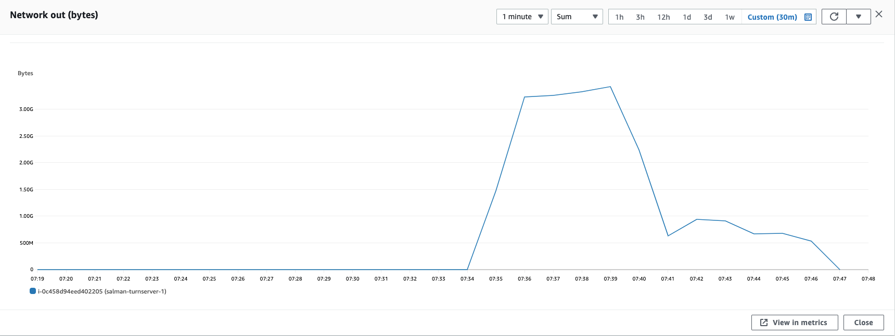
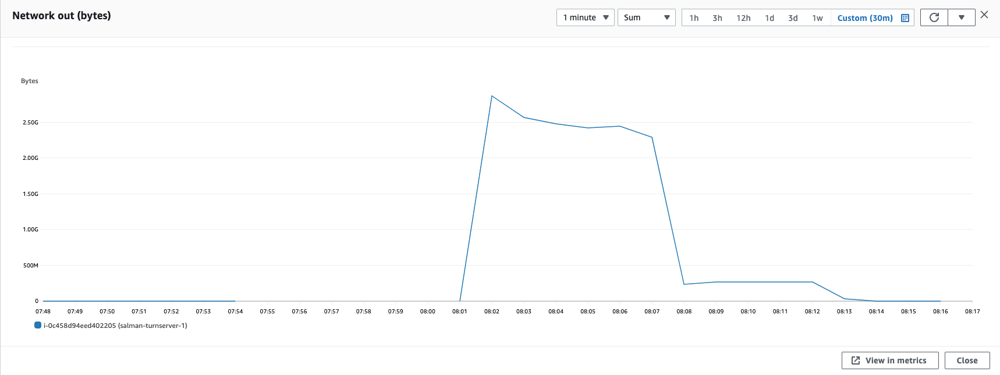

### Parameters

| Parameter | Value                |
| :-------- |:------------------------- |
| `concurent connections` | 1500 |
| `duration` | 300s |
| `packets per second` | 90 |
| `packet size` | 580 bytes |

## Results

|  Item | Coturn            |  Pion/Turn |
| :------------------------- |:------------------------- |:------------------------- |
| `Throughput` | 910.67 Mbps |  1000.78 Mbps|
| `CPU Usage` | 99.3% |  88.5% |
| `Response Time < 400ms` | 9.174% |  1.727% |
| `400 ms > Response Time < 1s` | 15.224% |  4% |
| `Packet Loss` | 65.70% |  93.466% |
| `Bad Packet Loss` | 49.328% |  70.07% |
| `Score` | -61.511 |  -91.32 |
| CPU |  |   |
| Network In |  |   |
| Network Out |  |   |