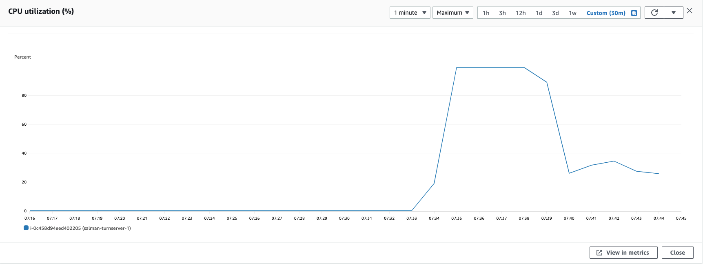
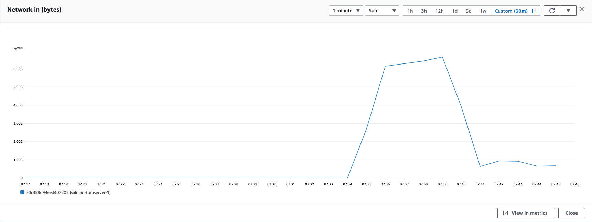
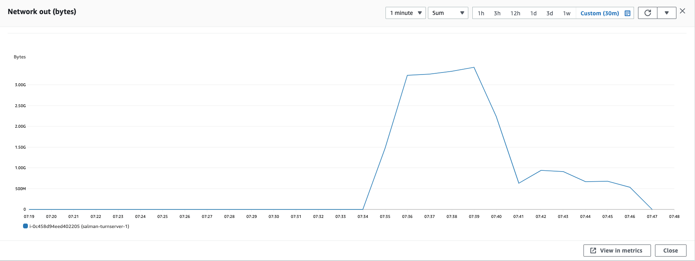

### Parameters

| Parameter | Value                |
| :-------- |:------------------------- |
| `concurent connections` | 1500 |
| `duration` | 300s |
| `packets per second` | 90 |
| `packet size` | 580 bytes |

## Results

### Coturn
| Parameter | Value                |
| :-------- |:------------------------- |
| `Throughput` | 910.67 Mbps |
| `CPU Usage` | 99.3% |
| `Response Time < 400ms` | 9.174% |
| `400 ms > Response Time < 1s` | 7.793% |
| `Packet Loss` | 83.03% |
| `Bad Packet Loss` | 50.365% |
| `Score` | -68.18 |

