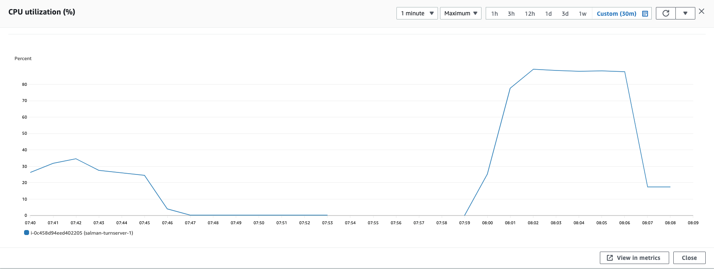
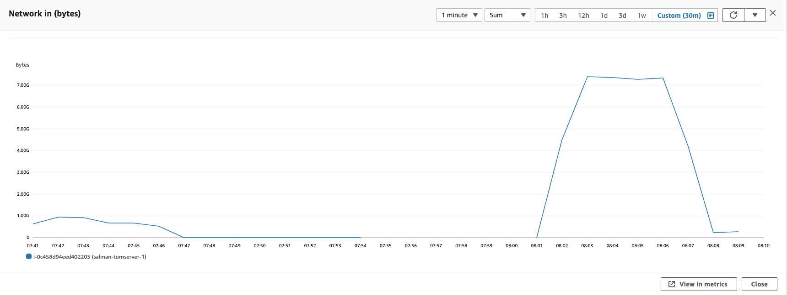
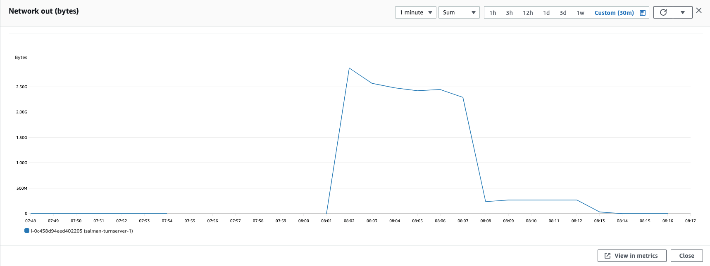

### Parameters

| Parameter | Value                |
| :-------- |:------------------------- |
| `concurent connections` | 2000 |
| `duration` | 300s |
| `packets per second` | 90 |
| `packet size` | 580 bytes |

## Results

### Pion/Turn
| Parameter | Value                |
| :-------- |:------------------------- |
| `Throughput` | 1000.78 Mbps |
| `CPU Usage` | 88.5% |
| `Response Time < 400ms` | 1.727% |
| `400 ms > Response Time < 1s` | 4% |
| `Packet Loss` | 93.466% |
| `Bad Packet Loss` | 70.07% |
| `Score` | -91.32 |

