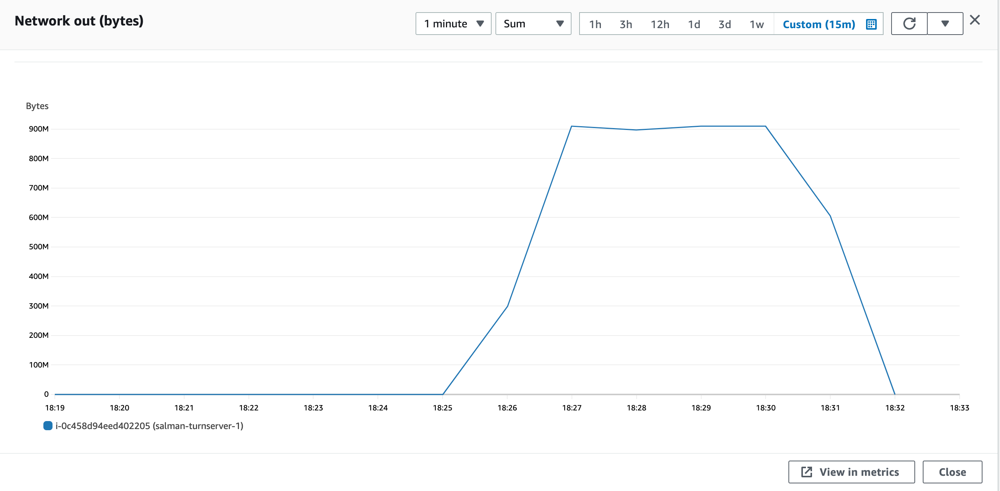

### Parameters

| Parameter | Value                |
| :-------- |:------------------------- |
| `concurent connections` | 2000 |
| `duration` | 300s |
| `packets per second` | 16 |
| `packet size` | 192 bytes |

## Results

|  Item | Coturn            |  Pion/Turn |
| :------------------------- |:------------------------- |:------------------------- |
| `Throughput` | 121.7 Mbps |  121.6 Mbps|
| `CPU Usage` | 74.8% |  84.8% |
| `Response Time < 400ms` | 65.408% |  54.629% |
| `400 ms > Response Time < 1s` | 34.226% |  42.525% |
| `Packet Loss` | 0.365% |  4.89% |
| `Bad Packet Loss` | 0% |  0% |
| `Score` | 9.122 |  8.246 |
| CPU |  |   |
| Network In |  |   |
| Network Out |  |   |