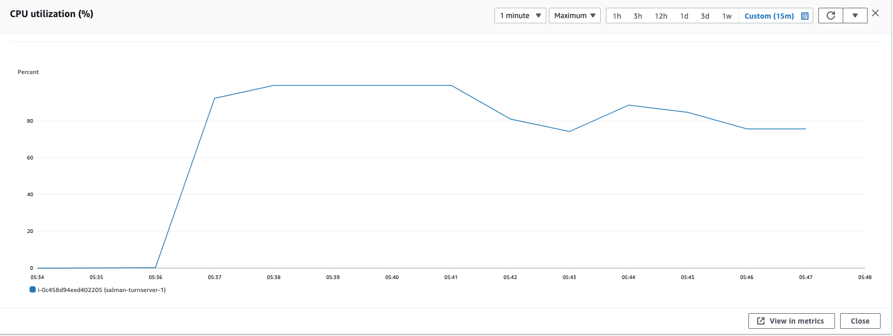
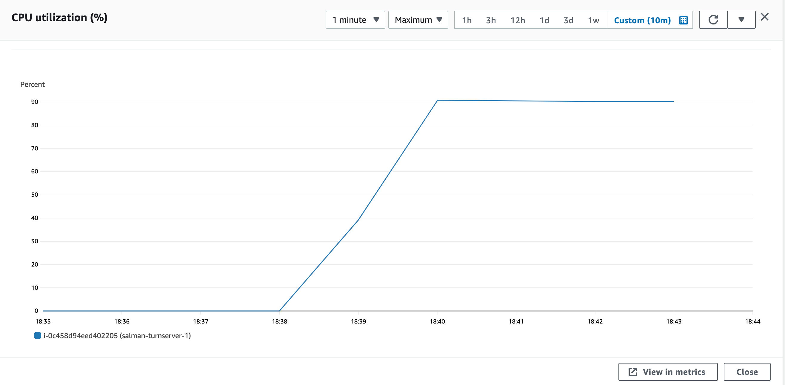
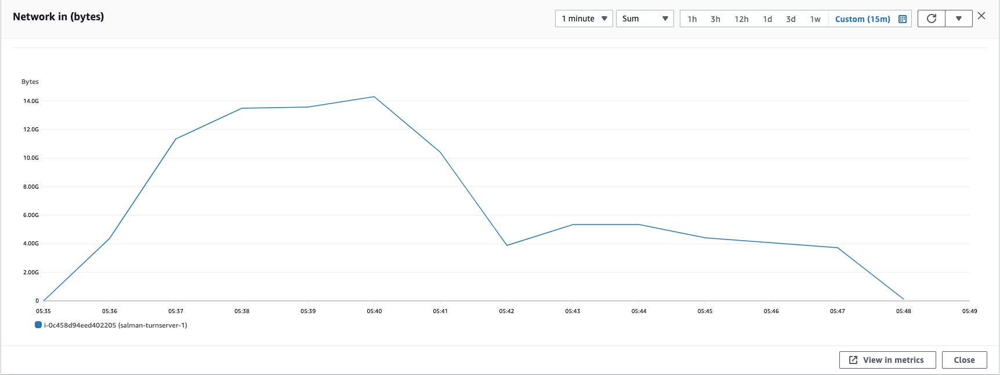
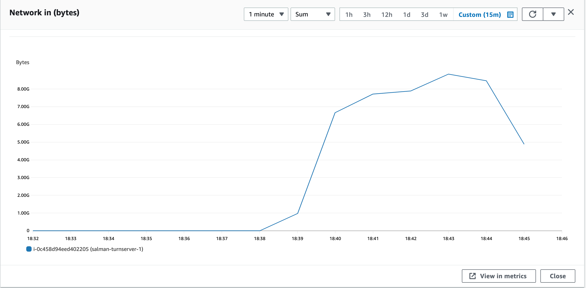
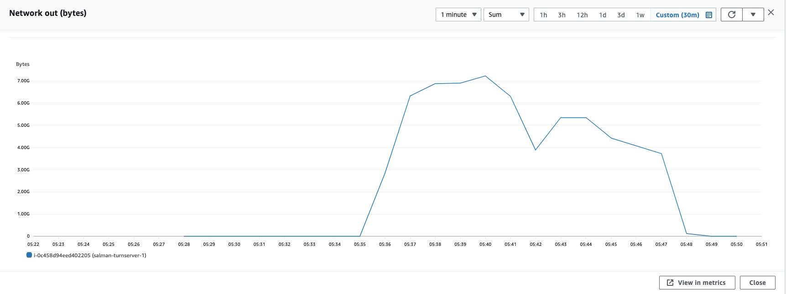
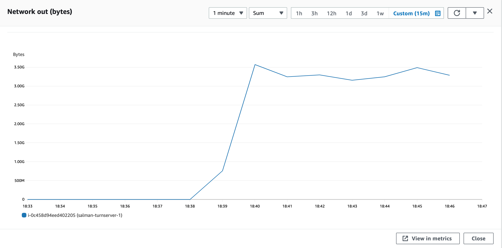

### Parameters

| Parameter | Value                |
| :-------- |:------------------------- |
| `concurent connections` | 2000 |
| `duration` | 300s |
| `packets per second` | 90 |
| `packet size` | 960 bytes |

## Results

|  Item | Coturn            |  Pion/Turn |
| :------------------------- |:------------------------- |:------------------------- |
| `Throughput` | 1952.427 Mbps |  1201.49 Mbps|
| `CPU Usage` | 99.4% |  90.7% |
| `Response Time < 400ms` | 19.07% |  1.6% |
| `400 ms > Response Time < 1s` | 15.224% |  5.438% |
| `Packet Loss` | 65.70% |  92.373% |
| `Bad Packet Loss` | 49.328% |  64.349% |
| `Score` | -61.511 |  -85.237 |
| CPU |  |   |
| Network In |  |   |
| Network Out |  |   |