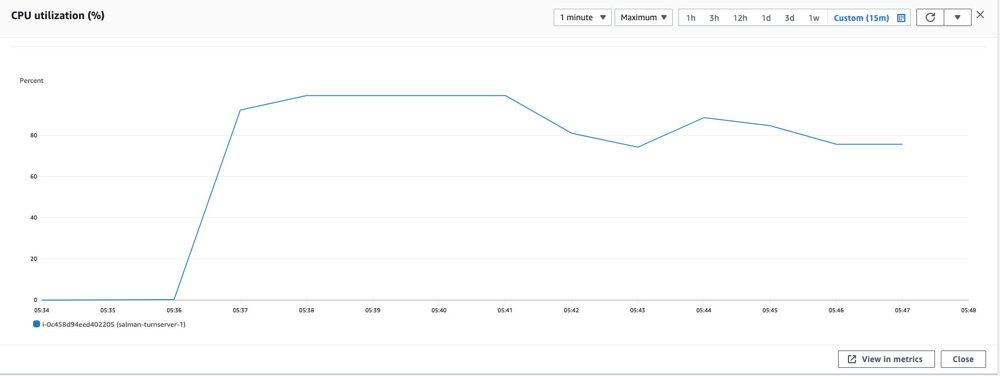

### Parameters

| Parameter | Value                |
| :-------- |:------------------------- |
| `concurent connections` | 2000 |
| `duration` | 300s |
| `packets per second` | 90 |
| `packet size` | 960 bytes |

## Results

### Coturn
| Parameter | Value                |
| :-------- |:------------------------- |
| `Throughput` | 1952.427 Mbps |
| `CPU Usage` | 99.4% |
| `Response Time < 400ms` | 19.073% |
| `400 ms > Response Time < 1s` | 15.224% |
| `Packet Loss` | 65.702% |
| `Bad Packet Loss` | 49.328% |
| `Score` | -61.511 |

