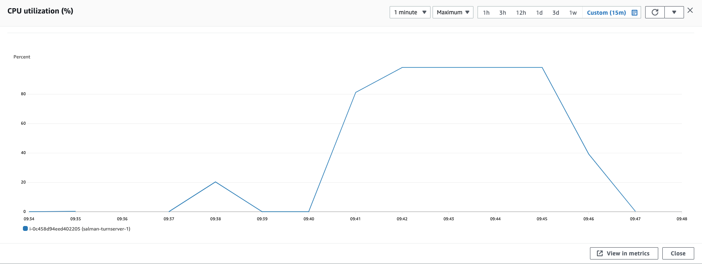

### Parameters

| Parameter | Value                |
| :-------- |:------------------------- |
| `concurent connections` | 2000 |
| `duration` | 300s |
| `packets per second` | 90 |
| `packet size` | 580 bytes |

## Results

### Pion/Turn
| Parameter | Value                |
| :-------- |:------------------------- |
| `Throughput` | 712.704 Mbps |
| `CPU Usage` | 98.1% |
| `Response Time < 400ms` | 7.663% |
| `400 ms > Response Time < 1s` | 46.924% |
| `Packet Loss` | 45.412% |
| `Bad Packet Loss` | 0.08% |
| `Score` | -5.845 |

