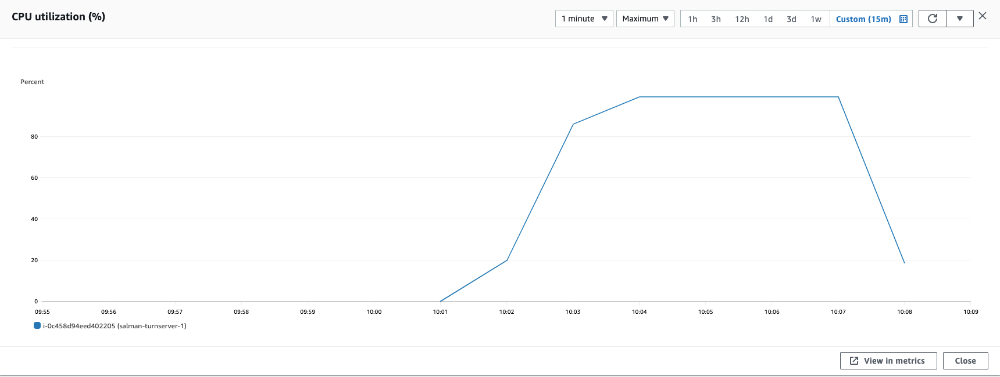
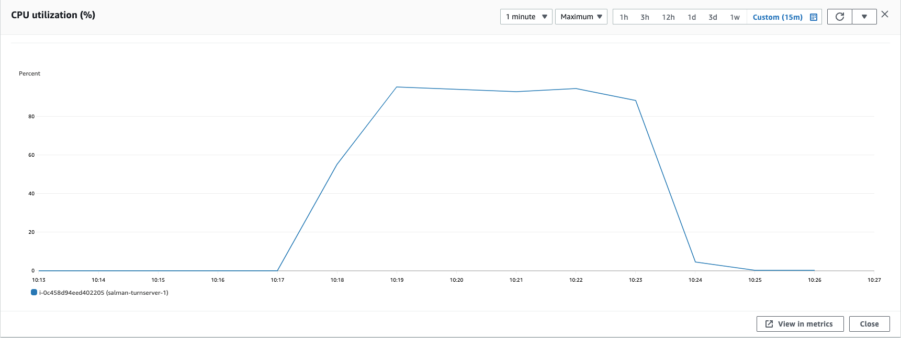
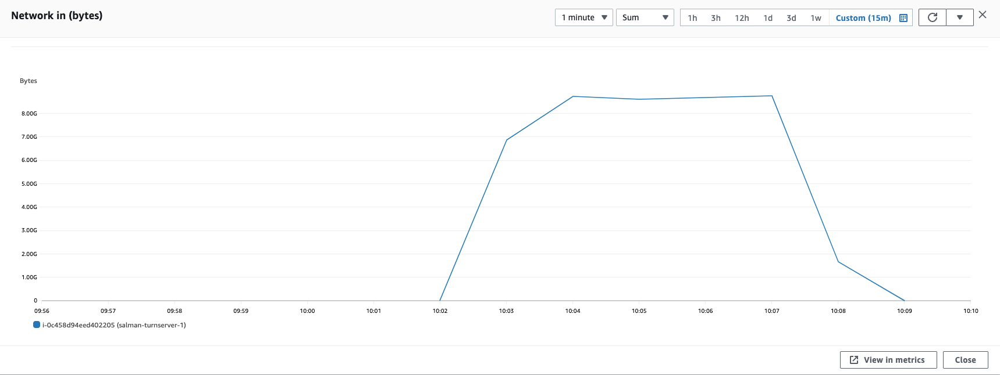
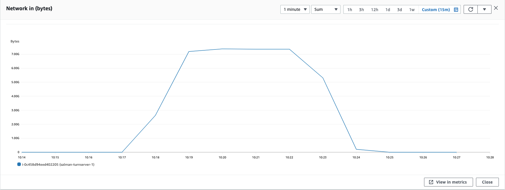
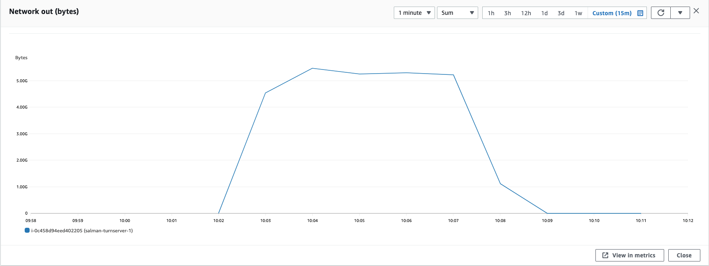
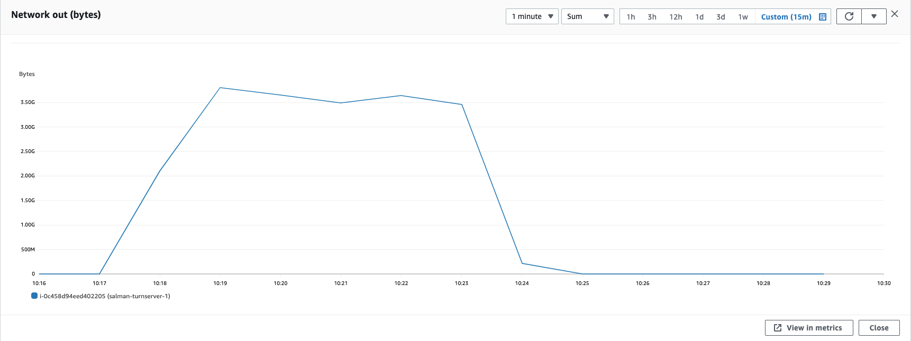

### Parameters

| Parameter | Value                |
| :-------- |:------------------------- |
| `concurent connections` | 800 |
| `duration` | 300s |
| `packets per second` | 90 |
| `packet size` | 960 bytes |

## Results

|  Item | Coturn            |  Pion/Turn |
| :------------------------- |:------------------------- |:------------------------- |
| `Throughput` | 1187.84 Mbps | 1007.616 Mbps |
| `CPU Usage` | 99.2% | 94.4% |
| `Response Time < 400ms` | 1.059% | 2.0617% |
| `400 ms > Response Time < 1s` | 22.808% | 14.976% |
| `Packet Loss` | 76.132% | 79.135% |
| `Bad Packet Loss` | 1.693% | 10.93% |
| `Score` | -17.362 | -27.6125 |
| CPU |  |   |
| Network In |  |   |
| Network Out |  |   |