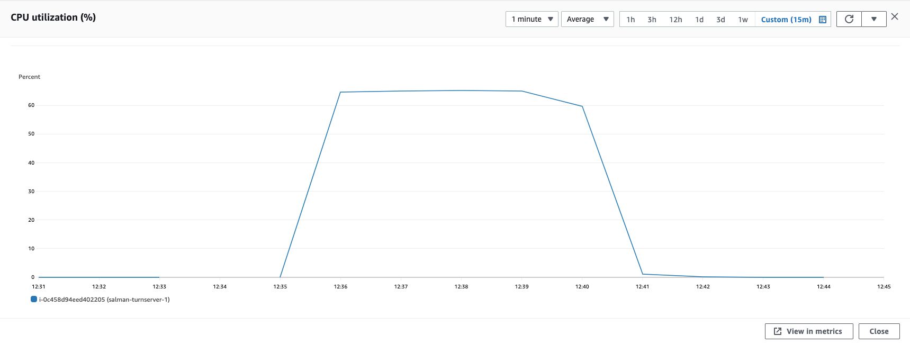

### Parameters

| Parameter | Value                |
| :-------- |:------------------------- |
| `concurent connections` | 1000 |
| `duration` | 300s |
| `packets per second` | 54 |
| `packet size` | 960 bytes |

## Results

|  Item | Coturn            |  Pion/Turn |
| :------------------------- |:------------------------- |:------------------------- |
| `Throughput` | 955.73 Mbps | 897 Mbps |
| `CPU Usage` | 65% | 77% |
| `Response Time < 400ms` | 68.28% | 59.411% |
| `400 ms > Response Time < 1s` | 31.7% | 33.78% |
| `Packet Loss` | 0.01% | 6.8% |
| `Bad Packet Loss` | 0% | 0% |
| `Score` | 9.26 | 7.02 |
| CPU |  |   |
| Network In |  |   |
| Network Out |  |   |