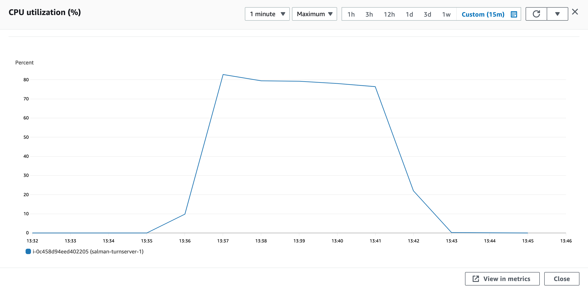
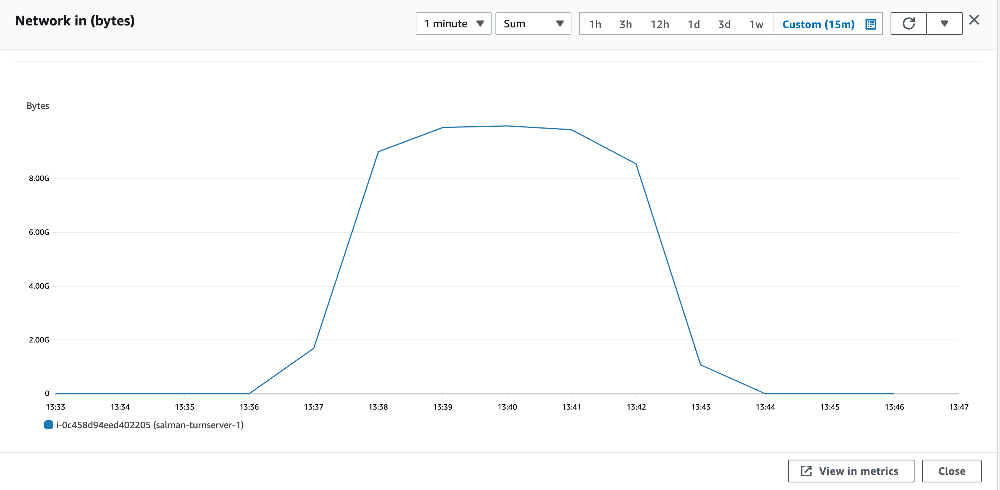
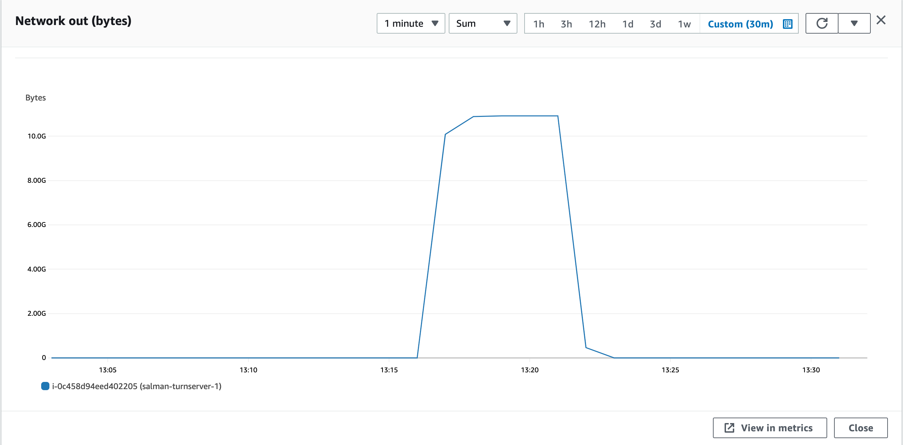

### Parameters

| Parameter | Value                |
| :-------- |:------------------------- |
| `concurent connections` | 1000 |
| `duration` | 300s |
| `packets per second` | 90 |
| `packet size` | 960 bytes |

## Results

|  Item | Coturn            |  Pion/Turn |
| :------------------------- |:------------------------- |:------------------------- |
| `Throughput` | 1488.2 Mbps | 1363.968 Mbps |
| `CPU Usage` | 86% | 80.6% |
| `Response Time < 400ms` | 57.257% | 5.269% |
| `400 ms > Response Time < 1s` | 42.68% | 21.02% |
| `Packet Loss` | 0.06% | 69.13% |
| `Bad Packet Loss` | 0% | 8% |
| `Score` | 9.16 | -21.67 |
| CPU |  |   |
| Network In |  |   |
| Network Out |  |   |