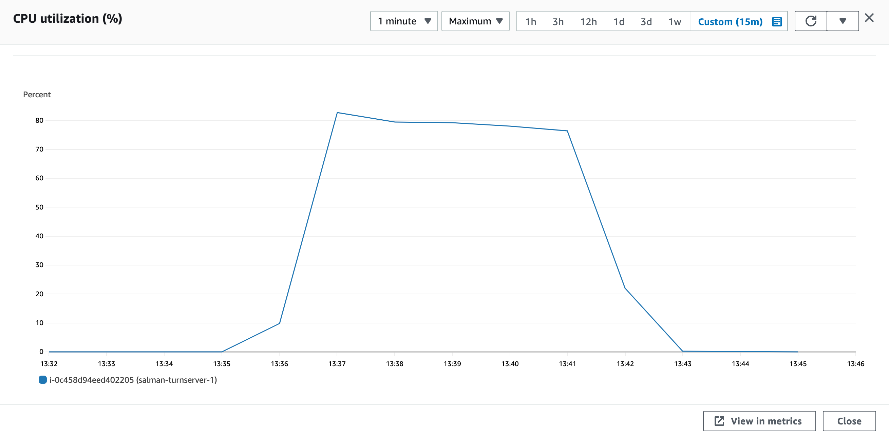
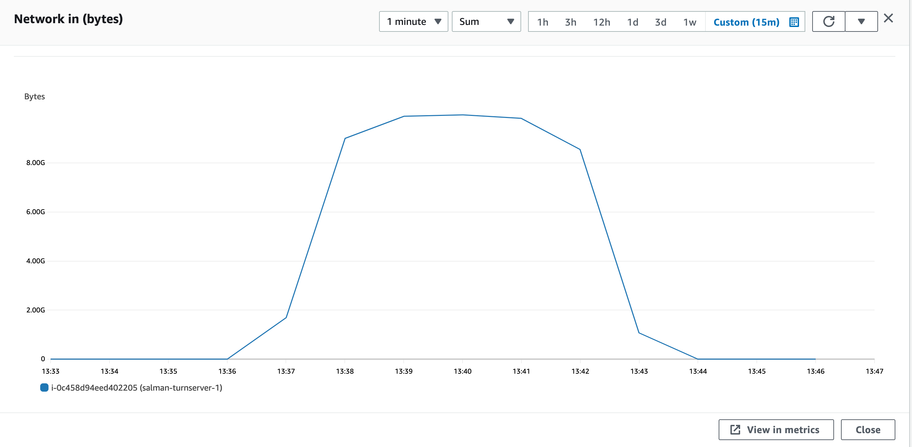
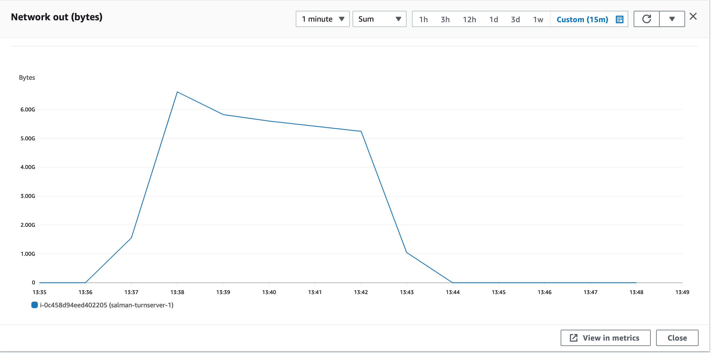

### Parameters

| Parameter | Value                |
| :-------- |:------------------------- |
| `concurent connections` | 1000 |
| `duration` | 300s |
| `packets per second` | 90 |
| `packet size` | 960 bytes |

## Results

### Pion/Turn
| Parameter | Value                |
| :-------- |:------------------------- |
| `Throughput` | 1363.968 Mbps |
| `CPU Usage` | 80.6% |
| `Response Time < 400ms` | 5.269% |
| `400 ms > Response Time < 1s` | 21.02% |
| `Packet Loss` | 69.13% |
| `Bad Packet Loss` | 8.21% |
| `Score` | -21.67 |

