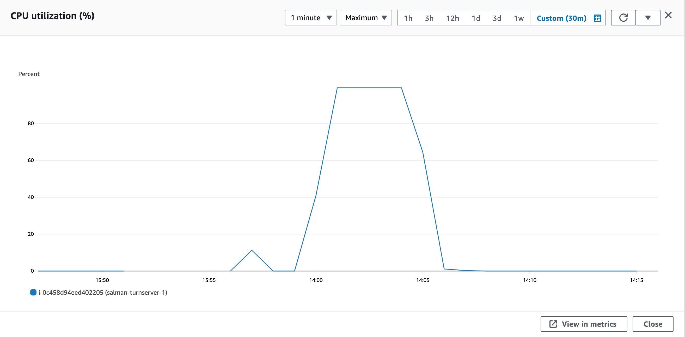
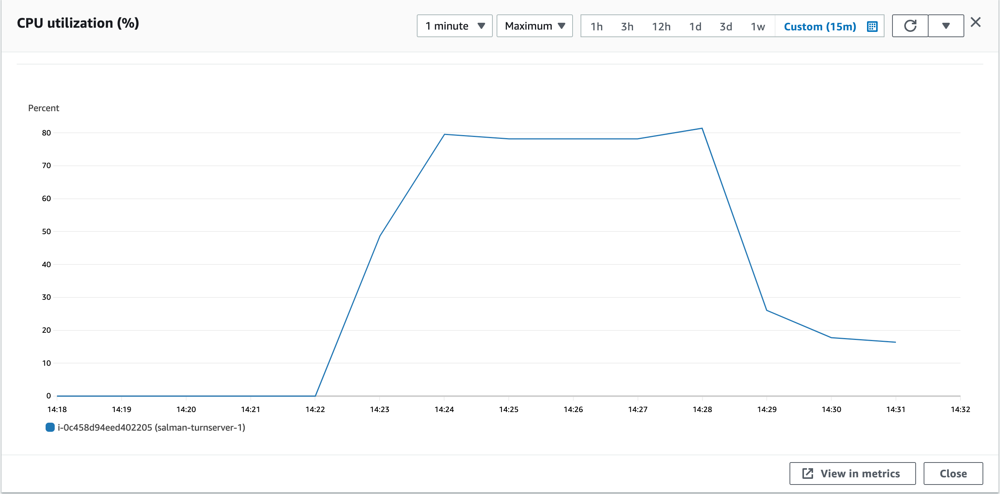
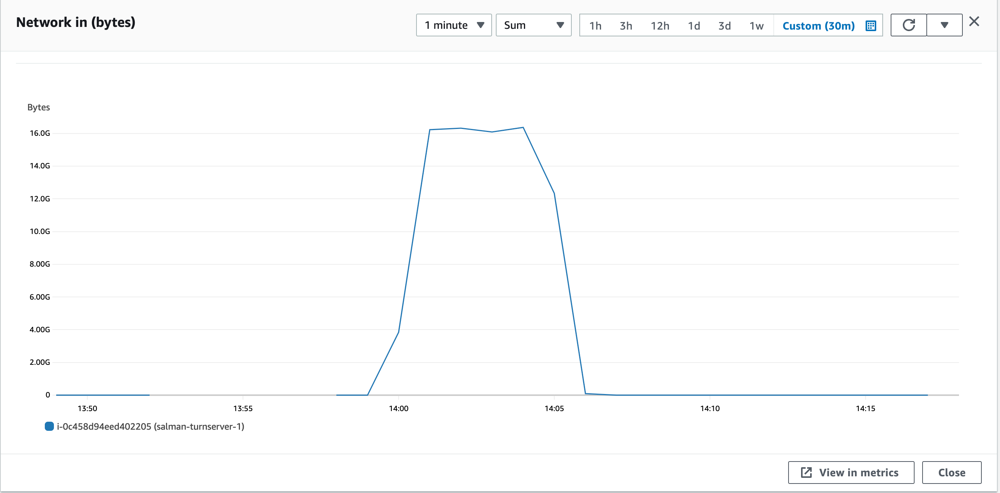
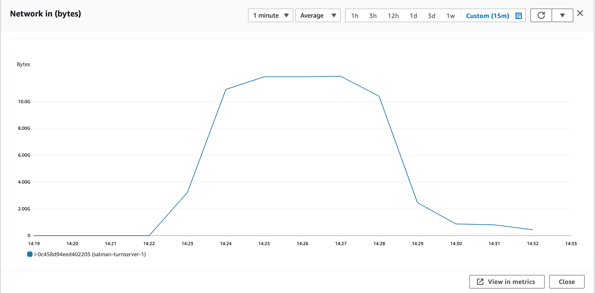
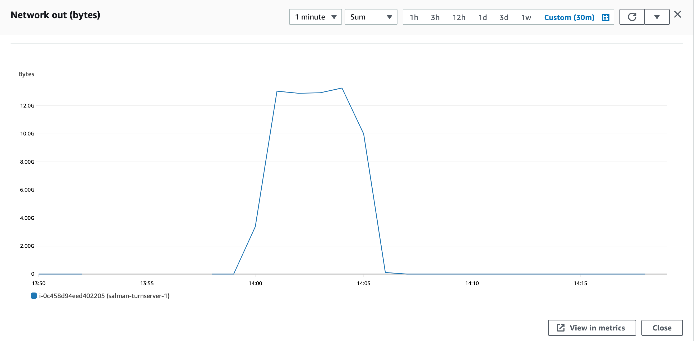

### Parameters

| Parameter | Value                |
| :-------- |:------------------------- |
| `concurent connections` | 1500 |
| `duration` | 300s |
| `packets per second` | 54 |
| `packet size` | 960 bytes |

## Results

|  Item | Coturn            |  Pion/Turn |
| :------------------------- |:------------------------- |:------------------------- |
| `Throughput` | 2239.14 Mbps | 1624.74 Mbps |
| `CPU Usage` | 99.7% | 81.2% |
| `Response Time < 400ms` | 16.691% | 3.889% |
| `400 ms > Response Time < 1s` | 44.56% | 9.678% |
| `Packet Loss` | 38.74% | 84.31% |
| `Bad Packet Loss` | 0% | 55.05% |
| `Score` | -3.55 | -73.35 |
| CPU |  |   |
| Network In |  |   |
| Network Out |  |   |