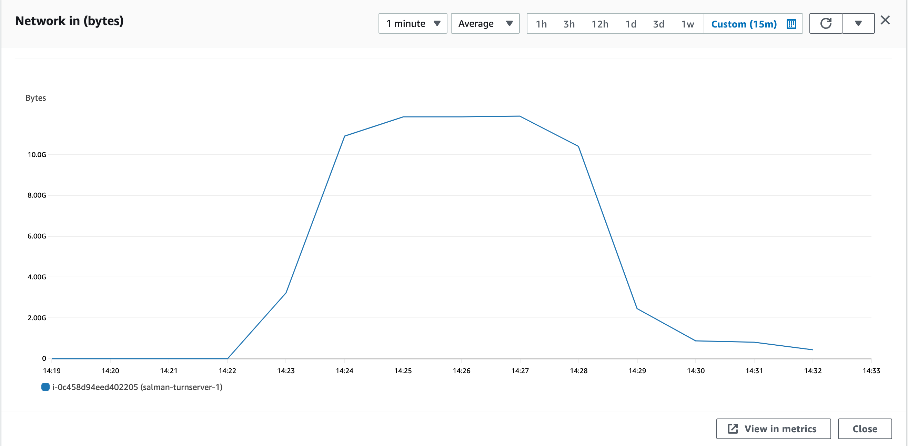

### Parameters

| Parameter | Value                |
| :-------- |:------------------------- |
| `concurent connections` | 1500 |
| `duration` | 300s |
| `packets per second` | 54 |
| `packet size` | 960 bytes |

## Results

### Pion/Turn
| Parameter | Value                |
| :-------- |:------------------------- |
| `Throughput` | 1624.74 Mbps |
| `CPU Usage` | 81.2% |
| `Response Time < 400ms` | 3.889% |
| `400 ms > Response Time < 1s` | 9.678% |
| `Packet Loss` | 84.31% |
| `Bad Packet Loss` | 55.05% |
| `Score` | -73.35 |

