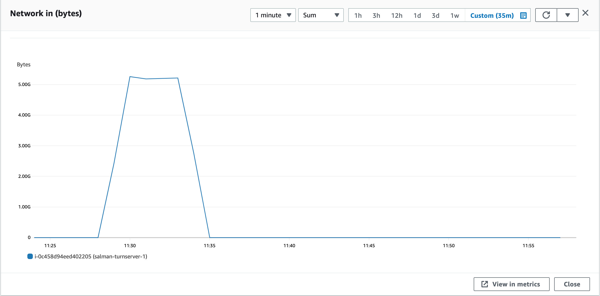
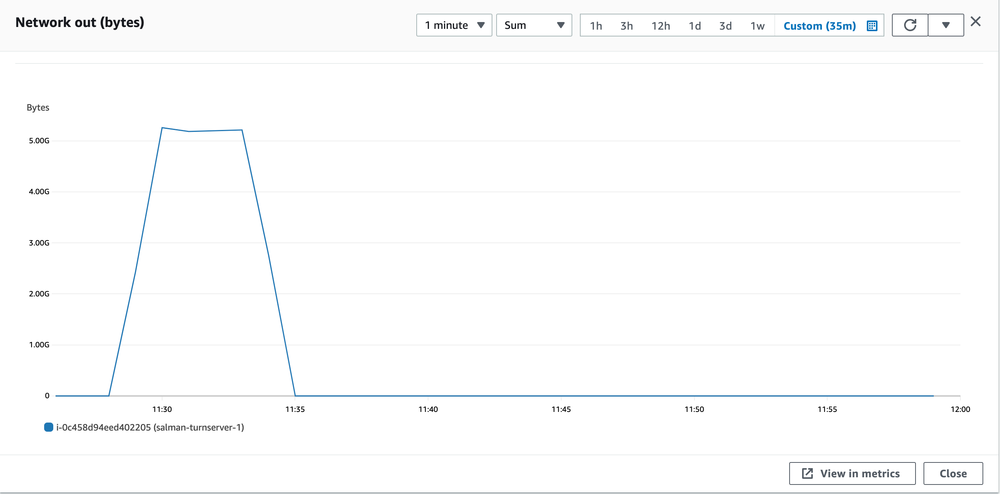

### Parameters

| Parameter | Value                |
| :-------- |:------------------------- |
| `concurent connections` | 800 |
| `duration` | 300s |
| `packets per second` | 54 |
| `packet size` | 960 bytes |

## Results

|  Item | Coturn            |  Pion/Turn |
| :------------------------- |:------------------------- |:------------------------- |
| `Throughput` | 709.97 Mbps | 719.5 |
| `CPU Usage` | 58.3% | 73.3% |
| `Response Time < 400ms` | 75.05% | 52.221% |
| `400 ms > Response Time < 1s` | 24.94%| 44.46% |
| `Packet Loss` | 0% | 3.31% |
| `Bad Packet Loss` | 0% | 0% |
| `Score` | 9.3 | 8.0825 |
| CPU |  |   |
| Network In |  |   |
| Network Out |  |   |