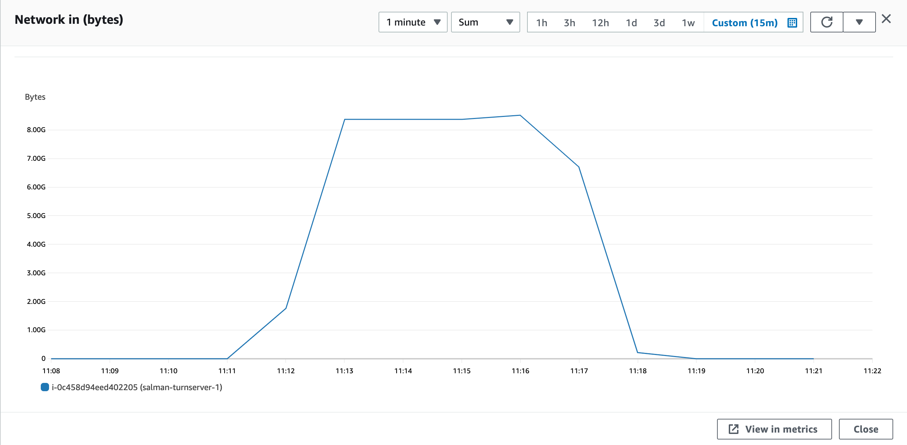

### Parameters

| Parameter | Value                |
| :-------- |:------------------------- |
| `concurent connections` | 800 |
| `duration` | 300s |
| `packets per second` | 90 |
| `packet size` | 960 bytes |

## Results

### Pion/Turn
| Parameter | Value                |
| :-------- |:------------------------- |
| `Throughput` | 1160.5 Mbps |
| `CPU Usage` | 85.4% |
| `Response Time < 400ms` | 7.35% |
| `400 ms > Response Time < 1s` | 35.09% |
| `Packet Loss` | 55.701% |
| `Bad Packet Loss` | 1.52% |
| `Score` | -10.615 |

