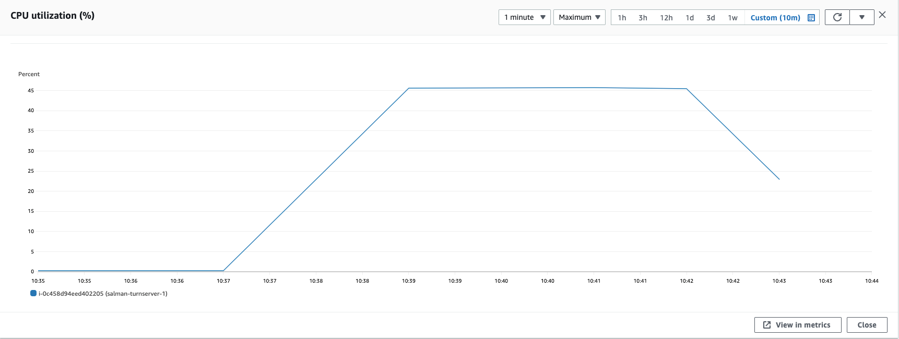
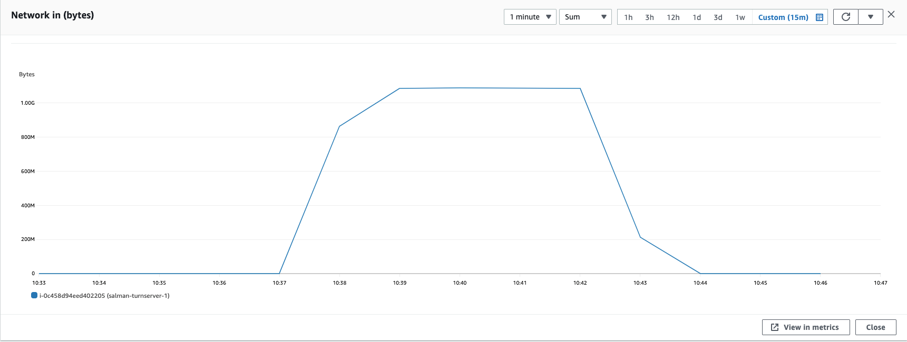

### Parameters

| Parameter | Value                |
| :-------- |:------------------------- |
| `concurent connections` | 100 |
| `duration` | 300s |
| `packets per second` | 90 |
| `packet size` | 960 bytes |

## Results

|  Item | Coturn            |  Pion/Turn |
| :------------------------- |:------------------------- |:------------------------- |
| `Throughput` | 100 Mbps |  100 Mbps|
| `CPU Usage` | 300% |  100% |
| `Response Time < 400ms` | 90% |  100% |
| `400 ms > Response Time < 1s` | 960% |  100% |
| `Packet Loss` | 960% |  100% |
| `Bad Packet Loss` | 960% |  100% |
| `Score` | 9 |  10 |
| CPU |  |   |
| Network In |  |   |
| Network Out |  |   |