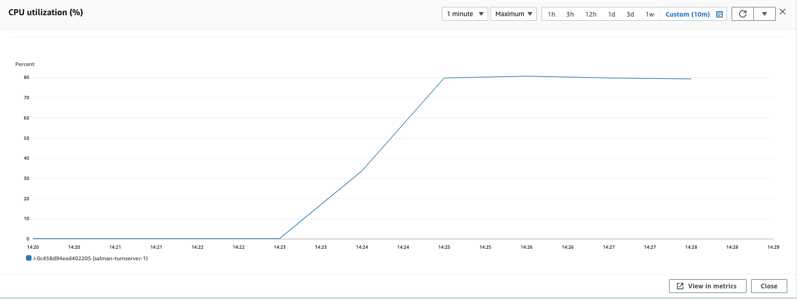
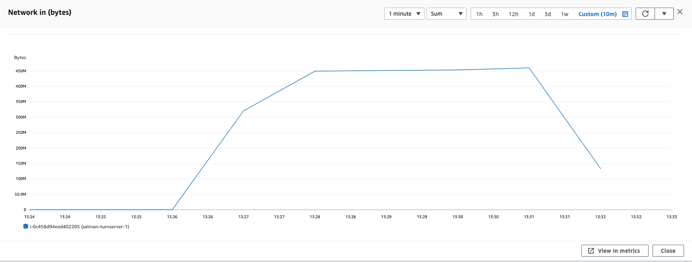

### Parameters

| Parameter | Value                |
| :-------- |:------------------------- |
| `concurent connections` | 1500 |
| `duration` | 300s |
| `packets per second` | 16 |
| `packet size` | 192 bytes |

## Results

### Pion/Turn
| Parameter | Value                |
| :-------- |:------------------------- |
| `Throughput` | 90.8 Mbps |
| `CPU Usage` | 80% |
| `Response Time < 400ms` | 39.94% |
| `400 ms > Response Time < 1s` | 58.53% |
| `Packet Loss` | 1.516% |
| `Bad Packet Loss` | 0% |
| `Score` | 8.557 |

