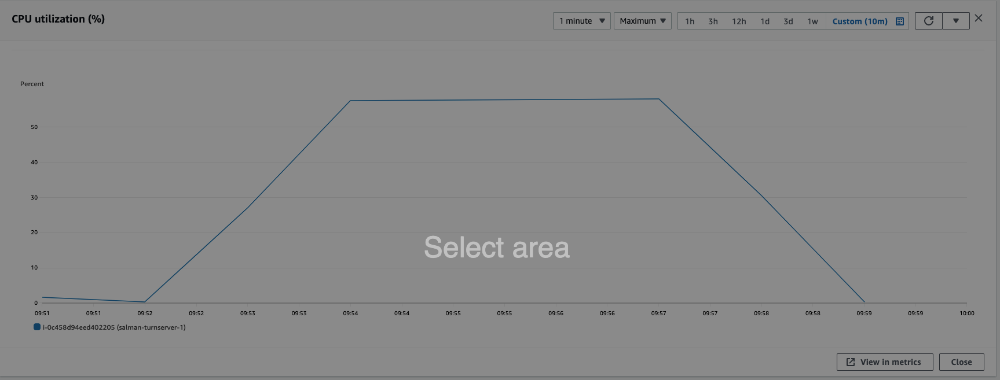
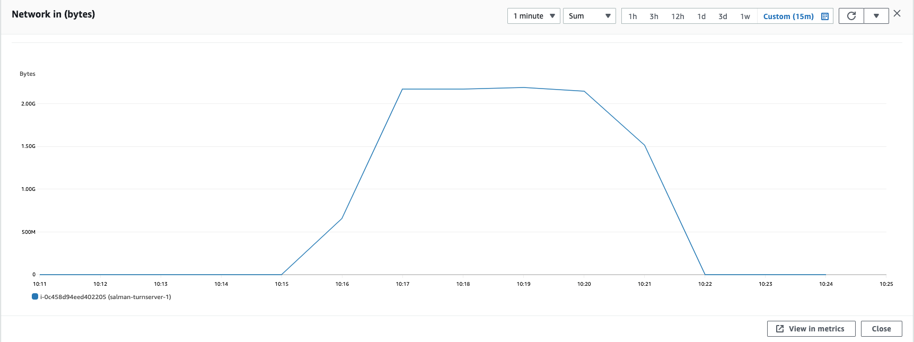

### Parameters

| Parameter | Value                |
| :-------- |:------------------------- |
| `concurent connections` | 100 |
| `duration` | 300s |
| `packets per second` | 90 |
| `packet size` | 960 bytes |

## Results

|  Item | Coturn            |  Pion/Turn |
| :------------------------- |:------------------------- |:------------------------- |
| `Throughput` | 297.64 Mbps | 297.64 Mbps |
| `CPU Usage` | 57.7% | 71.3% |
| `Response Time < 400ms` | 59.39% | 57.586% |
| `400 ms > Response Time < 1s` | 40.57% | 39.95% |
| `Packet Loss` | 0.036% | 2.457% |
| `Bad Packet Loss` | 0% | 0% |
| `Score` | 9.18 | 8.4 |
| CPU |  |   |
| Network In |  |   |
| Network Out |  |   |