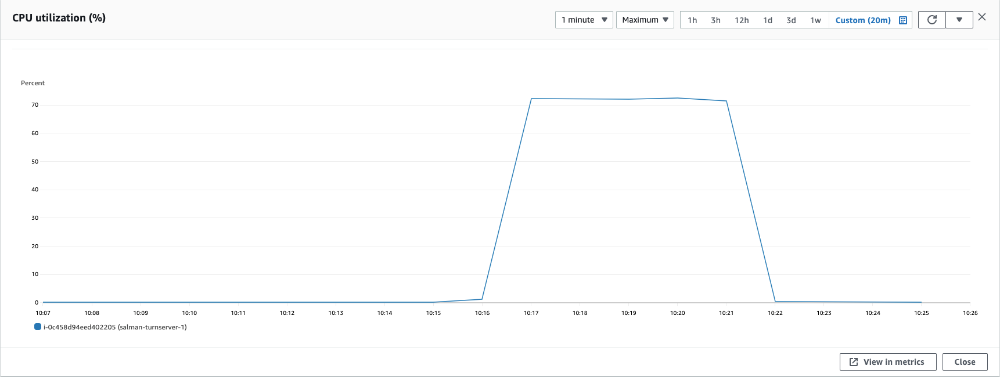
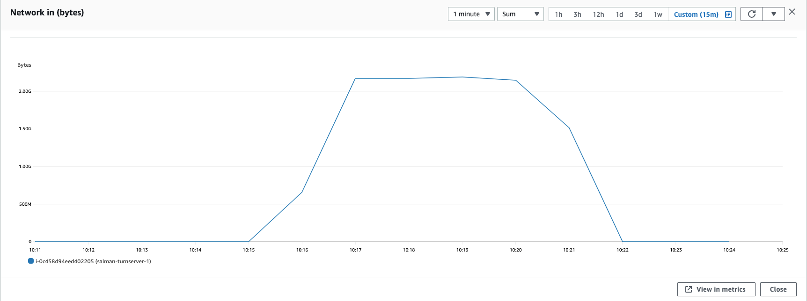

### Parameters

| Parameter | Value                |
| :-------- |:------------------------- |
| `concurent connections` | 100 |
| `duration` | 300s |
| `packets per second` | 90 |
| `packet size` | 960 bytes |

## Results

### Pion/Turn
| Parameter | Value                |
| :-------- |:------------------------- |
| `Throughput` | 297.64 Mbps |
| `CPU Usage` | 71.3% |
| `Response Time < 400ms` | 57.586% |
| `400 ms > Response Time < 1s` | 39.95% |
| `Packet Loss` | 2.457% |
| `Bad Packet Loss` | 0% |
| `Score` | 8.4 |

